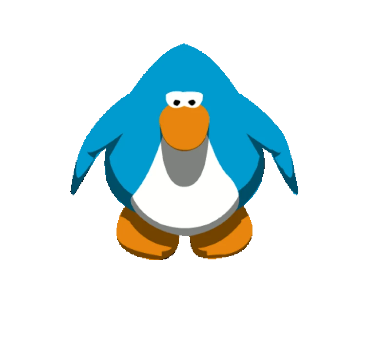

# Game Design and Development Decal Fall 2026

{: .announcements }   
> <h2>Week 2 (9/14)</h2>
> 
>
> Hey guys! We hope you enjoyed the first two sessions of our DeCal last week :D
>
> Every Sunday, we will plug weekly DeCal-related announcements and reminders, such as due dates and other events, to both the DeCal website as well as the Discord server on this announcements channel.
>
>
> **Programmers**: You should be adding ``berkeleyGameDev`` as a collaborator to your Project 1 repository, and keep the project submission as a private repo.
>
> **Artists**: Please be aware that the deadline for Part 1 is BEFORE CLASS and not 11:59! That way, we can get art critiques in-class rolling smoothly.
>
> |**Date**|**Due in Class**|**Assigned**|
> | Tuesday (9/15) | All Lab 1 | Programmer Lab 4 / Artist Lab 5, due 09/22 |
> | Thursday (9/17) | Programmer Lab 2 / Artist Lab 3 Project 1 Part 1, due at 11:59PM. | Programmer Lab 6 / Artist Lab 7, due 09/24 in class. Project 1 Part 2, due 09/24 at 11:59PM.

| -------- |
| Jump to Week: [0](#week-0), [1](#week-1)|

<!-- , [1](#week-1), [2](#week-2), [3](#week-3), [4](#week-4), [5](#week-5), [6](#week-6), [7](#week-7), [8](#week-8), [9](#week-9), [10](#week-10), [11](#week-11), [12](#week-12), [13](#week-13),[14](#week-14) -->

## Schedule


{{ module }}


[Lab 0: Setup Unity]: ./pages/labs/lab0/lab0
[Lab 1]: ./pages/labs/lab1/lab1
[Lab 2]: ./pages/labs/lab2/lab2
[Lab 3]: ./pages/labs/lab3/lab3
[Lab 4]: ./pages/labs/lab4/lab4
[Lab 5]: ./pages/labs/lab5/lab5
[Lab 6]: ./pages/labs/lab6/lab6
[Lab 7]: ./pages/labs/lab7/lab7
[Lab 8]: ./pages/labs/lab8/lab8
[Lab 9]: ./pages/labs/lab9/lab9
[Lab 10]: ./pages/labs/lab10/lab10
[Lab 11]: ./pages/labs/lab11/lab11
[Lab 12]: ./pages/labs/lab12/lab12
[Lab 13]: ./pages/labs/lab13/lab13
[Lab 14]: ./pages/labs/lab14/lab14
[Lab 15]: ./pages/labs/lab15/lab15
[Lab 16]: ./pages/labs/lab16/lab16
[Lab 17]: ./pages/labs/lab17/lab17
[Project 1]: ./pages/projects/Projects
[Project 2]: ./pages/projects/project2/project2
[Project 3]: ./pages/projects/project3/project3

[form]: https://forms.gle/WrDUcRKpRqHvDXwA7

[Apply]: https://tinyurl.com/fa25gddapp

[Click here for infosession slides!]: https://docs.google.com/presentation/d/1LADC9Byt52I4q0NpYCA9_YU4Q4a-XVkh1xN95CsGlIo/edit?usp=sharing

