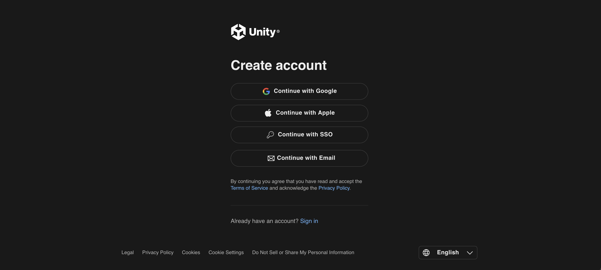
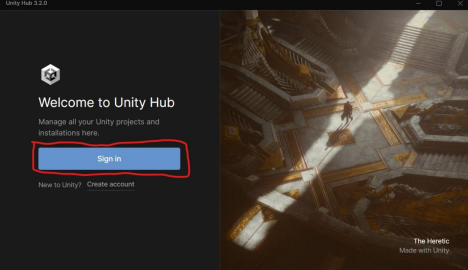
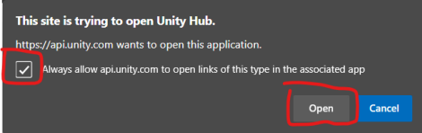
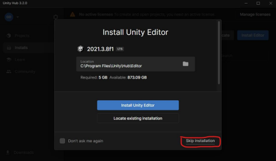
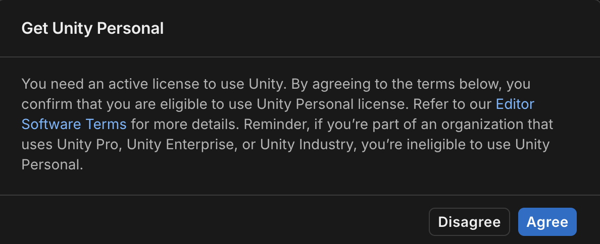
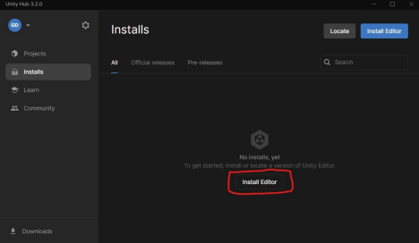
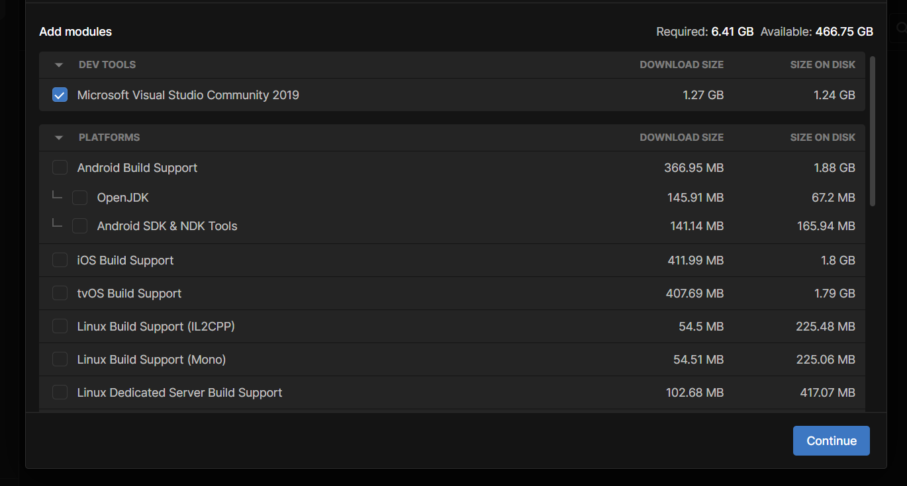
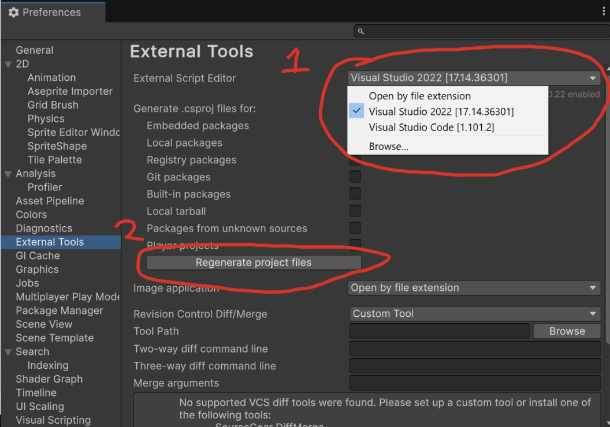

# Lab 0: Unity Setup
{: .no_toc }

## Table of contents
{: .no_toc .text-delta }

1. TOC
{:toc}

<!-- **DISCLAIMER**: This setup tutorial is for Mac and Windows Computers.  If you have a Chromebook or a Linux system, we recommend looking up a YouTube tutorial on how to do so (there are a lot online!)  -->

## Creating a Unity ID
If you already have a Unity ID, you may skip this step. Otherwise, [create a Unity account].

*Note*: You do not have to use your berkeley.edu email.

## Installing Unity Hub

1. Install Unity Hub by clicking on the link below. The download should automatically be configured to a detected platform, but you can also manually download a specific format on the same page.

    [Download]

{: .note}
> You will be prompted to make a Unity ID if you don't already have one. Once you login with one, you will be redirected to the download menu. **You are not required to use your berkeley.edu email.**

2. Follow the steps listed on the page to download and open the installer. Mac instructions are listed below.

    

3. Sign in with the Unity ID you just created.

    

4. If you see this prompt, check the box and click `open`.

    

5. If prompted to install a Unity Editor, skip for now.

    

6. Click `Get Personal Edition License`.

    

## Installing the Unity Editor

1. On the left navigation panel, go to `Installs -> Install Editor`.

    

2. Go to `Archive` and search for `6000.3.18f1`. Click Install (will prompt an install in your Unity Hub).

4. By default, Unity will install Visual Studio as the text editor for your scripts. If you would prefer to use a different editor such as [VS Code For Unity], then un-check this box.

    For the purposes of this class, we will only ever ask you to build your project as an executable. (WebGL executables will be covered later in the course, once we reach the final project!)

    This means for Windows users, check `Windows Build Support (IL2CPP)`.

    For Mac users, check `Mac Build Support (IL2CPP)`.

    You can always install other build support modules later on. After selecting your modules, press `Continue -> Install`.

    *Note: The install may take a while to complete.*
    
    

After your Unity Editor finishes installing, you're all set up!

## Troubleshooting
If IntelliSense is not working properly in your IDE, go to `Edit > Preferences > External Tools`, and make sure to select your IDE of choice for ‘External Script Editor’. Then regenerate the project files: 

{: .note }
Visual Studio and VS Code have their own packages for Unity dev that should be installed beforehand!

**Still Stuck?** 
While the editor version is outdated, the general principle stayw the same in [this video](https://www.youtube.com/watch?v=ewiw2tcfen8). 

## Bug Reports
If you experience any bugs or typos within the lab itself, please report it [here!]

[here!]: https://forms.gle/JAPYBPsvmKueXjhXA
<!-- [create a Unity account]: https://id.unity.com/en/conversations/02f34c66-e99a-487b-bf0b-669778c319cc002f -->
[Download]: https://unity.com/download
[VS Code For Unity]: https://code.visualstudio.com/docs/other/unity
