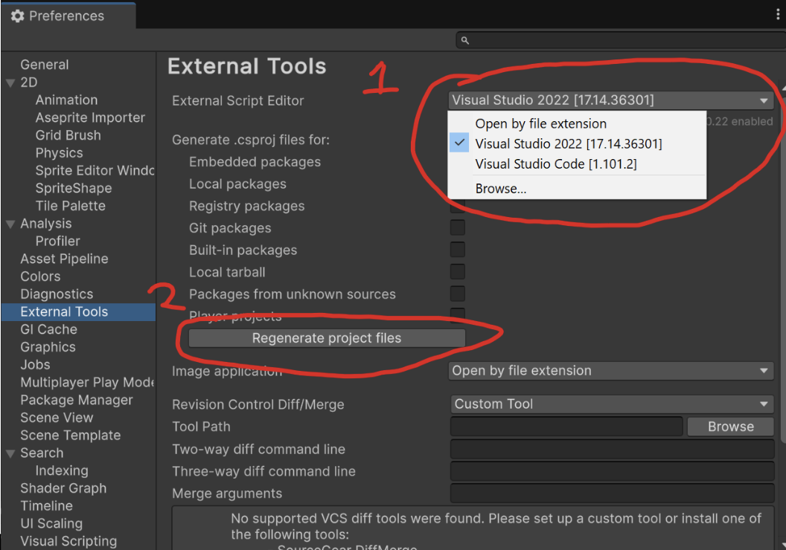

# Lab 0: Unity Setup
{: .no_toc }

## Table of contents
{: .no_toc .text-delta }

1. TOC
{:toc}

**DISCLAIMER**: This setup tutorial is for Macs and Windows Computers.  If you have a Chromebook or a Linux system, we recommend looking  up a YouTube tutorial on how to do so (there are a lot online!) 

## Creating a Unity ID
If you already have a Unity ID, you may skip this step. Otherwise, [create a Unity account].

*Note*: You do not have to use your berkeley.edu email.

## Installing Unity Hub
1. Install Unity Hub by clicking one of the following links, depending on your system.

    [Windows Download]

    [Mac Download]

2. Install Unity Hub. If you get this prompt, click `Allow access`.

    

3. Sign in with the Unity ID you just created.

    

4. If you see this prompt, check the box and click `open`.

    

5. If prompted to install a Unity Editor, skip for now.

    

6. Click `Get Personal Edition License`.

    

## Installing the Unity Editor

1. On the left navigation panel, go to `Installs -> Install Editor`.

    

2. Go to `Archive -> Download Archive`

    

3. Go to the `Unity 6` tab and search for `6000.0.64f1`. Click Install (will prompt an install in your Unity Hub).

    

4. By default, Unity will install Visual Studios as the text editor for your scripts. If you would prefer to use a different editor such as [VS Code For Unity], then un-check this box.

    For the purposes of this class, we will only ever ask you to build your project as an executable. (Webgl executables will be covered later in the course, once we reach the final project!)

    This means for Windows users, check `Windows Build Support (IL2CPP)`.

    For Mac users, check `Mac Build Support (IL2CPP)`.

    You can always install other build support modules later on. After selecting your modules, press `Continue -> Install`.

    *Note: The install may take a while to complete.*
    
    

After your Unity Editor finishes installing, you're all set up!

## Troubleshooting
If intellisense is not working properly in your IDE, go to `Edit > Preferences > External Tools`, and make sure to select your IDE of choice for ‘External Script Editor’. Then regenerate the project files: 

{: .note }
Visual Studio and VS Code have their own packages for unity dev that should be installed beforehand!

**Still Stuck?** 
While the editor version is outdated, the general principle stay the same in [this video](https://www.youtube.com/watch?v=ewiw2tcfen8). 

## Bug Reports
If you experience any bugs or typos within the lab itself, please report it [here!]

[here!]: https://forms.gle/JAPYBPsvmKueXjhXA
[create a Unity account]: https://id.unity.com/en/conversations/02f34c66-e99a-487b-bf0b-669778c319cc002f
[Windows Download]: https://public-cdn.cloud.unity3d.com/hub/prod/UnityHubSetup.exe
[Mac Download]: https://public-cdn.cloud.unity3d.com/hub/prod/UnityHubSetup.dmg
[VS Code For Unity]: https://code.visualstudio.com/docs/other/unity
