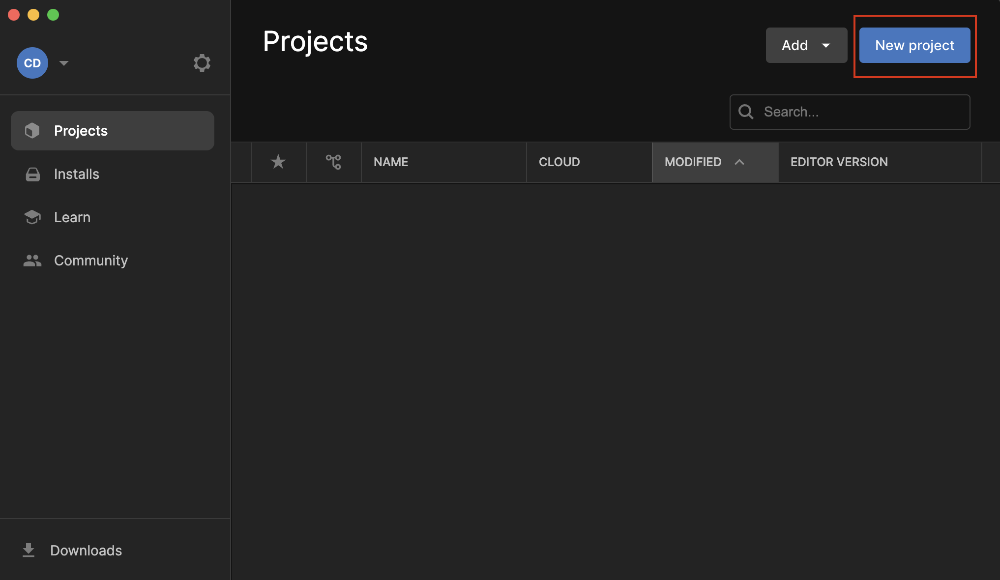
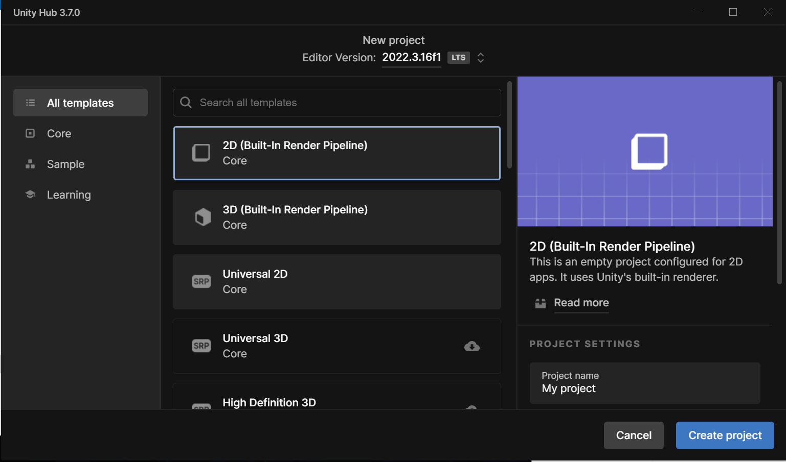
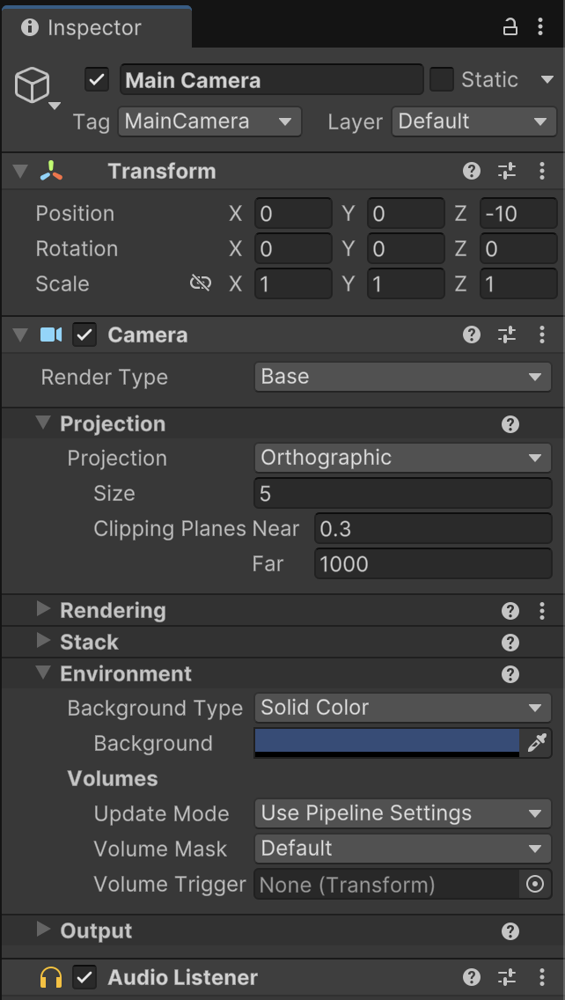
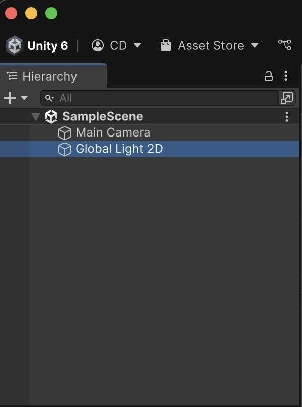
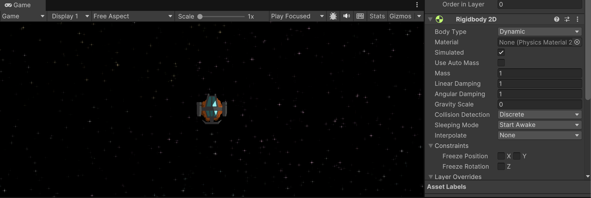

# Lab 1: Intro to Unity
{: .no_toc }

## Table of contents
{: .no_toc .text-delta }

1. TOC
{:toc}

**NOTE**: Please download this lab before starting! (You can also clone the repository if you're familiar with GitHub)

[Download Lab 1](https://github.com/berkeleyGamedev/UnityBasics/archive/refs/heads/master.zip){: .btn .btn-blue }

## Lab Overview 
In this lab, you will be putting together a small game from scratch! You don’t need to know any programming or how to make  art; this is an introduction to the basics of the Unity engine.

## Lab Instructions
### Setting up your project
When you open up Unity, you should see something like this. Click on the arrow next to the New button on the top right hand corner: Make sure you select version **2021.3.16f1**, as this is the version that the labs in this class will be working under.

Now you should see a screen like the one below. Title your project whatever you want in the project name field (the name of this is not  important, as we will be working on a different project later in this lab), and make sure the template is in 2D. Choose whichever location you  want the project to be in your computer. Once you’ve filled everything in, click Create project.

After waiting for a bit, you should see a screen like this. It’s okay if it doesn’t look exactly like this. As you continue developing, you will figure  out which setup works best for you.

**IMPORTANT FOR PROGRAMMERS:** Before continuing, check that Visual Studio is selected as the External Script Editor for Unity.  

In the top menu, go to `Unity > Settings/Preferences > External Tools.`

Select Visual Studio as the External Script Editor **(Note that Visual Studio and Visual Studio Code are different)**

Now, let’s talk about how to navigate through Unity. The editor has a lot of different windows, and if you don’t see one that is mentioned here,  you can look at the Window tab in the toolbar and click on it to open it up.

### Project and Console

The first window we will look at is the Project window.

This window shows all of the files and folders that are usable assets for your project. Everything you need, from sprites to scripts, will be here. In a new project, the Assets folder will not have anything in it except for the scenes folder. Scenes are different files that are made using all of the assets; think of them as different levels. They all draw from the same pre-existing assets, but have a different format and layout. We’ll start adding more to this once we start the lab.

Next to the Project window is the Console window.

If there are any errors that occur within the project, like compiling errors in code, missing components or invalid code, the errors will show up here. Also, if you print anything in code (using Debug.Log()), it will also show up here. This window can be extremely useful in debugging code.

### Hierarchy and Inspector

The Hierarchy window contains all of the GameObjects that are currently being used in a scene. GameObjects are the basic building components in Unity. Every object you see is basically some sort of GameObject, and each GameObject can have extra components and scripts attached to it, giving each of them their own unique properties and behaviors. Right now, your Hierarchy should only have the Main Camera.

The Inspector window allows you to view and edit the properties and components of GameObjects. If you click on a GameObject in the Hierarchy window, you can see all of the components currently attached to the GameObject. The Main Camera should have the fields for Transform, Camera, and Audio Listener.

To add new components or scripts, press Add Component, which is located at the bottom of the Inspector. You can look for specific components in the search bar. If you want to add the component, just click on it and it should show up under everything else. Another way to add a script is to simply locate it in the project window and drag it into the inspector.

### Scene and Game

Here, you can organize the layout of this particular scene. The Game window shows what the game will look like through the camera when it is running, and the Scene window is where you will actually move and manipulate each item in the scene. There is a toolbar in the top left corner that will help you move around in the scene.

 1. Move the scene view
 2. Moves objects vertically or horizontally
 3. Rotates objects
 4. Scales objects
 5. Moves objects freely
 6. A combination of 2-5

 Above the Scene and Game windows are the play, pause, and step buttons.

1. The play button will start running the game inside the editor so that you can test the game. Hitting the play button while the game is running will stop the game.
2. The pause button will pause the game on a frame when you are playing it, which is useful when you want to debug a problem.
3. The step button allows you to skip forward a frame. It will pause the game if it isn’t already paused. This is also useful for debugging as  it allows you to go frame by frame.

In addition, you can change variables in the inspector while the game is running, but when you stop playing the game, your changes will be reverted back to what they were before you started playing. This is important to keep in mind while testing your game.

Now that you have learned some of the basics, let’s start making a game!

## Space Shooter Game
### Setting it up

Close the project you made. Open Unity Hub again, and click the arrow next to "Open". Then click "Add project from disk" and select the Unity Basics lab folder. Then, open the project up. It might take a while for Unity to set up all of the project files. Once inside the project, navigate to `Scenes > SampleScene` and double click it to open it up.

Go into the Sprites folder. Find the bg image and drag it into the hierarchy (just click and drag). This will be the background for the game.

Now look in the inspector on the right (your "bg" GameObject should be selected). **Expand Additional Settings and set the Sorting Layer to Background**. Once you do this, the background will always be behind the other GameObjects you put in.

Now expand your image by clicking on it in the scene and dragging the corners so that it extends past the gray box that indicates what the camera can see.

### Character

Now let’s add a character.

Go in the Sprites folder again and choose the ship to be the character. Drag it into the hierarchy. Let’s add interactivity by adding some scripts for movement. Click on the ship in the hierarchy, and in the inspector, click Add Component. **Type in Movement and select the PlayerMovement script.** To make it work, **we also need to add a Rigidbody2D component. Set the Gravity Scale to 0.** Your Inspector should look like this afterwards (*Tip:* minimize components in the inspector by clicking the little gray arrow next to its icon!):

Click on the play button near the top of the editor and your game should start. Use the arrow keys or WASD to rotate and Spacebar to thrust forwards. As you can see, our ship is a little hard to control! You can adjust the movement and rotation speed in the Inspector. **Remember, changes made while playing the game will NOT be saved! So make sure you stop playing the game (press the play button again) before you change the speeds, or else your new values will be lost when you restart the game.**

*(Optional Tip: Change your Playmode tint in Preferences/Colors/General: Playmode tint to a light red, and it will be obvious when you're in playmode so you wont make these mistakes!)*

Let’s add some particle effects to our ship. Go into the Prefabs folder. Drag the Flare prefab into the hierarchy and **make it a child** of the ship, so that it will move with the ship. You can do this by dragging the Flare prefab directly onto the ship object in the hierarchy.

Once you do this, if you hit play, you should see flames trailing behind your character!

Now, let’s make it so that the ship can wrap around the screen. **Add the ScreenBounds script to the ship.** Once you press play you can see the ship will teleport to the opposite side if it is about to go offscreen.

### Asteroids

Now let’s add something that the player can interact with. 

Add the asteroid into the scene by dragging the asteroid sprite into the hierarchy. Add the Rigidbody2D component so that it can move, and set the gravity to 0 and the linear and angular drag to 1. 

This will allow the asteroid to slowly stop moving if it is ever touched. Now to create interactivity between the objects, let’s add some colliders. Add a component called CircleCollider2D to both the ship and the asteroid. You might need to adjust the radius for the collider to fit better. 

*(Tip: Click the Edit Collider Button under the Circle Collider 2D component and you’ll be able to resize the radius in the Scene view!)*

When you hit play, the asteroid and the ship can now collider and interact with each other.

### Health

Now let’s add something more interesting. Let’s make it so that the player has health, and every time it touches an asteroid, its health goes down. **Add the PlayerHealth component to the ship.** This will keep track of the current health, and decrease it if the player interacts with an asteroid.

If the player collides with an object, the script will check what the object's tag is. If the collided object's tag is "Asteroid," then the player’s health is decreased. To allow this to work, however, **we need to change the tag of the asteroid to "Asteroid".** In the inspector, click the "Untagged" dropdown and select "Asteroid" to do so.

To add some UI to see the player's health, look in the prefabs folder and drag the UI prefab into the hierarchy. You should be able to see the health and score when you click play. You can’t see it in the scene because the UI overlays on a UI canvas. But if you zoom way out in the Scene view, you should be able to see the words.

The UI also takes care of the win condition of the game. Right now, you need a score of 5 to win, as you can see in the Score To Win field of the UI script. To make the system work, you need to do one more thing. Select the player in the hierarchy and **change the tag for the player to Player.** Just like with the asteroid, the UI uses the Player tag to know which object’s health to keep track of.

You can click play and hit the asteroid 3 times to see that the player loses all its health and loses the game. If all done correctly, the game  should look something like this:

### Bullet

Now let’s add a way for the player to get rid of the asteroids. Find the laser image in the Sprites folder and drag in into the hierarchy.

**Add a CapsuleCollider2D component to the laser** and fiddle around with the size until the capsule fits the size of the laser. This collider allows us to see what the laser interacts with. **Also set the IsTrigger field in this component to True.** This will allow us to know when objects touch each other without causing the objects to move each other.

Also add the Rigidbody2D component for movement, and set the gravity and drag to 0.

Finally, **add the Bullet script** (`laser selected > Add Component > Bullet`). This keeps track of who shot the bullet, which will be used to keep track of score.

Now we want to make the laser a prefab. A prefab is an instance of a GameObject, so it saves a GameObject and all its components and fields. This way, you can create multiple instances of the same GameObject. We use this property to make copies of the same laser when the game is running. **You can do this by dragging the laser from the hierarchy into the Prefabs folder.** Once you have a copy of it in your Prefabs folder, delete the one in the hierarchy (right click + Delete).

Now let’s make sure it spawns from the correct location. Select the ship in the hierarchy and create a new GameObject. You can do this by right clicking on the ship and creating a new empty object. This way, it will be a child of the ship. Name it something like Laser Spawner.

You can move the laser spawner to the position from which you want the laser to shoot. Since I want it to shoot from the tip of the ship, I’ll move it to the tip, like so: (select the 2nd option in the Scene view toolbar to move GameObjects around)

**Now add the PlayerShoot script to the laser spawner. Set a reference of the laser to the script by dragging your new laser prefab into the Laser Prefab field.**

Now, when you play, you should be able to press Left Shift to shoot, destroy asteroids, and gain points.

*Optional:* Try changing Score To Win in UI Script to a number that will make you win faster, or duplicating the asteroids by selecting one and pressing CTRL/CMD + D in order to create more obstacles to destroy for more points!

## Lab Summary

Now that you’ve the basics of components, prefabs, scripts, and how they work with each other, you’re on your way to learning how Unity works! All of these concepts are the bread and butter of using Unity, so you can always refer back to this document if you need a refresher on how these components work.

## Checkoff

Show your game to a facilitator to get this lab checked off!

## Challenges (Optional)

Now that you have some basics, try creating a small game! Some possible ideas are a precision-based maze game, a racing game, or a shooting game. Feel free to use anything, including functionality that we did not go over in the lab.

Hint: You can create a prefab of the asteroid and create multiple instances of the same asteroid by dragging the prefab into your scene.

## Bug Reports
If you experience any bugs or typos within the lab itself, please report it [here!]

[Lab 1 Repo]: https://github.com/berkeleyGamedev/UnityBasics
[here!]: https://forms.gle/1C2GPHGDHCQo3WWe7 