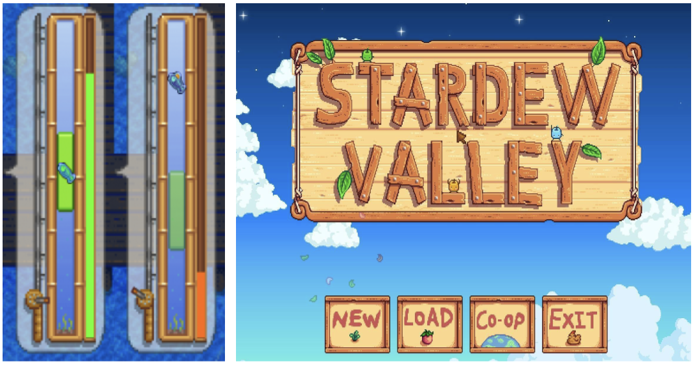
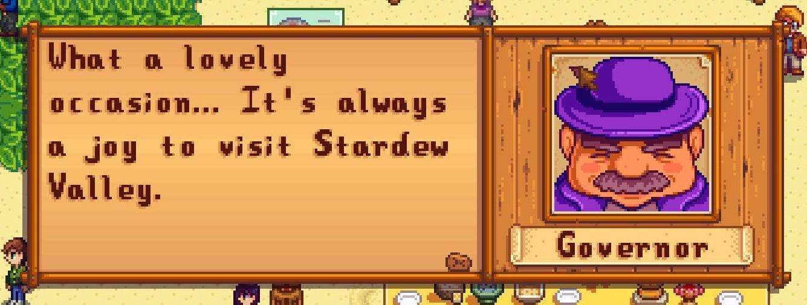
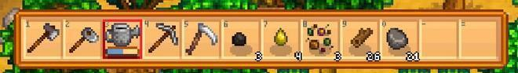
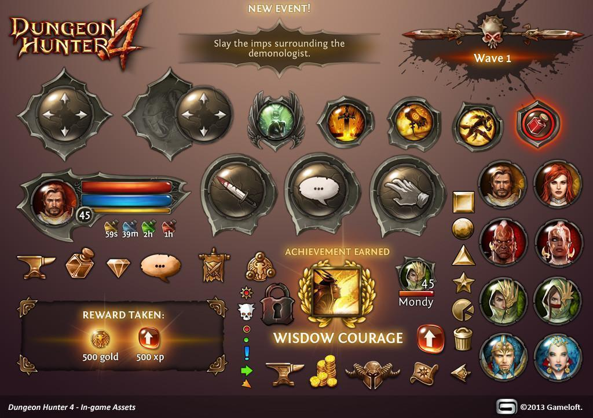
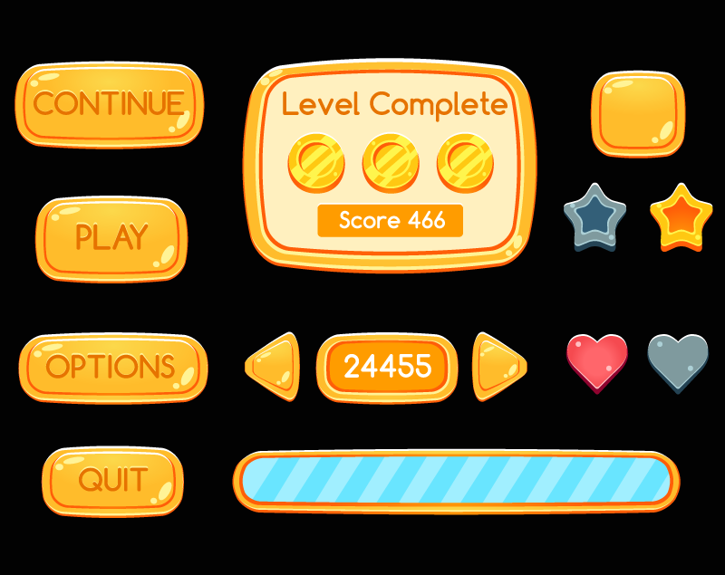
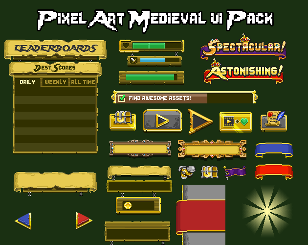
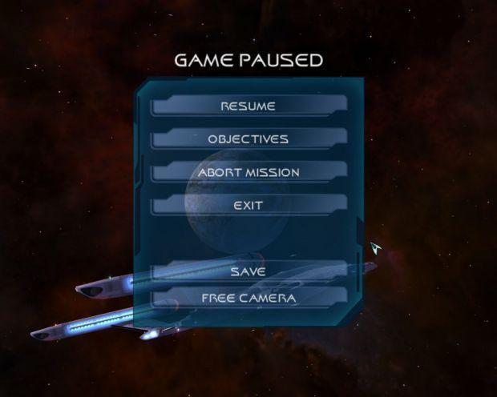
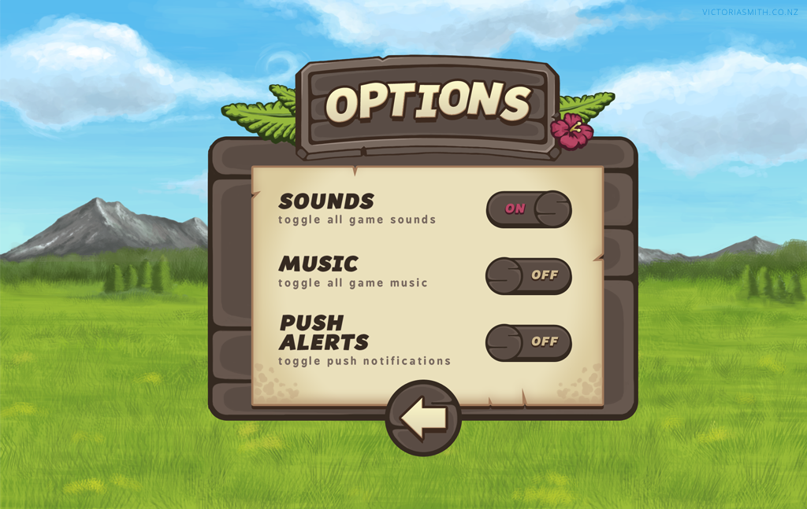
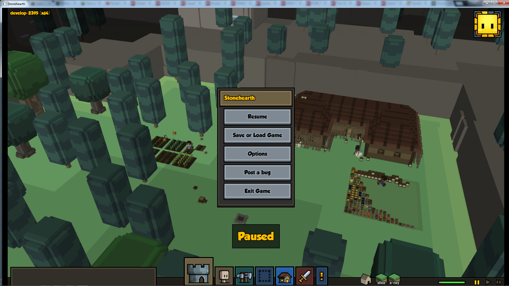

# Lab 10: UI Asset Creation
{: .no_toc }

## Table of contents
{: .no_toc .text-delta }

1. TOC
{:toc}

## Overview

In creating games, a core part of tying the entire game together is through UI. User Interface (UI)  encompasses anything the player interacts with. This includes things like health bars, stat meters, text labels, screen shake, dialogue, and a whole lot more. As an artist for this decal, the UI assets you’ll most likely be working on include a start menu, health bar, in-game texts, and an in-game menu, along with others specific to your game genre of choice.

UI is a very underrated aspect of game design. If done well, it goes unnoticed. If done wrong, it completely disrupts the immersion of the game. This lab will teach you how to create cohesive UI assets to tie your game together!

## Analysis

First, it’s always great to take a look at what works well. Very popular titles like Hollow Knight, Stardew Valley, Overwatch, and even Minecraft have all nailed down their UI assets.

||
|:--:|
|Stardew Valley UI Examples|

Looking at these assets, it’s evident they all belong to the same game. There’s a general wooden feel to the assets, with wooden backgrounds to the title image and the background behind the governor. All the assets also have a dark brown wooden frame around them, visible in the buttons on the start screen, dialogue box, fishing game, and inventory. The color palette of these assets is an analogous palette of various browns. 

Below are a few more examples of UI assets that have a very cohesive theme.

## Color

By looking at these examples, it can be noted that UI tends to have a simple and generally monochromatic color palette. They’re not supposed to be a very large focal point of the game, but just there to aid in making it more stylized. However, important elements are colored and designed to be more noticeable, such as the bright design in the rewards in the Dungeon Hunter 4 example, or the congratulating words “spectacular” and “astonishing” in the Medieval UI Pack. It’s up to you to distinguish what parts of UI are more important than others; although, generally elements that directly correlate with gameplay should stand out more, such as the health bar.

Taking a look at these two menus, the general color scheme of UI assets is one that contrasts enough with the background to stand out, but don’t stand out so much as to distract from the general gameplay. They also generally contain 2 main colors, with the top/first/space game being blue and white and the bottom/second/nature game being brown and beige. A limited palette is best for UI as to not take away from the game. 

## UI Assets in Unity

Your games in this decal should all be **16:9** and **1920px by 1080px**. Keep that in mind when sizing your assets. One way you can work with this is take a 1920x1080 screenshot of your background (if it’s larger than that, ex. in a side-scroller) and import it into your drawing program. Then, draw your assets on layers on top of the background. This way, you always have a good way to gauge the size of the assets without having to import it into Unity and resize it in the program. We recommend setting each UI element to its own layer as well, so you can readily resize and reposition them individually. 

There are many ways to add extra flairs to UI assets within Unity that are more technical artist/programmer specific, and that as an artist you probably will not have to do (but is good to know). Some of these include adding text, changing colors of buttons when hovered and clicked, and more, but will not be covered in this lab as its purpose is to get you artists familiar with creating UI assets. 

As an artist, if you are not the one implementing assets into Unity, it’s important to keep up communication with the programmer to keep the look consistent. Be sure to communicate important design elements like how the UI will be anchored to the screen as well as font and color, which are things the programmer changes within Unity.

## Check-off

Redesign UI of a game. Design a health bar, stat tracker (could track anything, points, etc), an inventory with minimum 2 items in the slots, and an in-game menu with pause, restart, resume, and options. These assets should fit in and be themed with the environment (screenshot) of your favorite (or not so favorite) games. (If you are having issues finding a background without the game's original UI in the way, try adding the term "cutscene" to your search!)

Create the assets and apply them on top of an image of your background, like so (with the correct assets):
Tip: it is recommended you draw ontop of your background (on a layer above) when planning and designing your UI assets in order to get a feel for the theme and scale

## Bug Reports
If you experience any bugs or typos within the lab itself, please report it [here!]

[here!]: https://forms.gle/oiyM6iu3MinHfmNc7 
