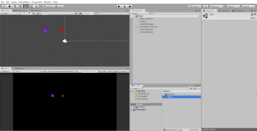
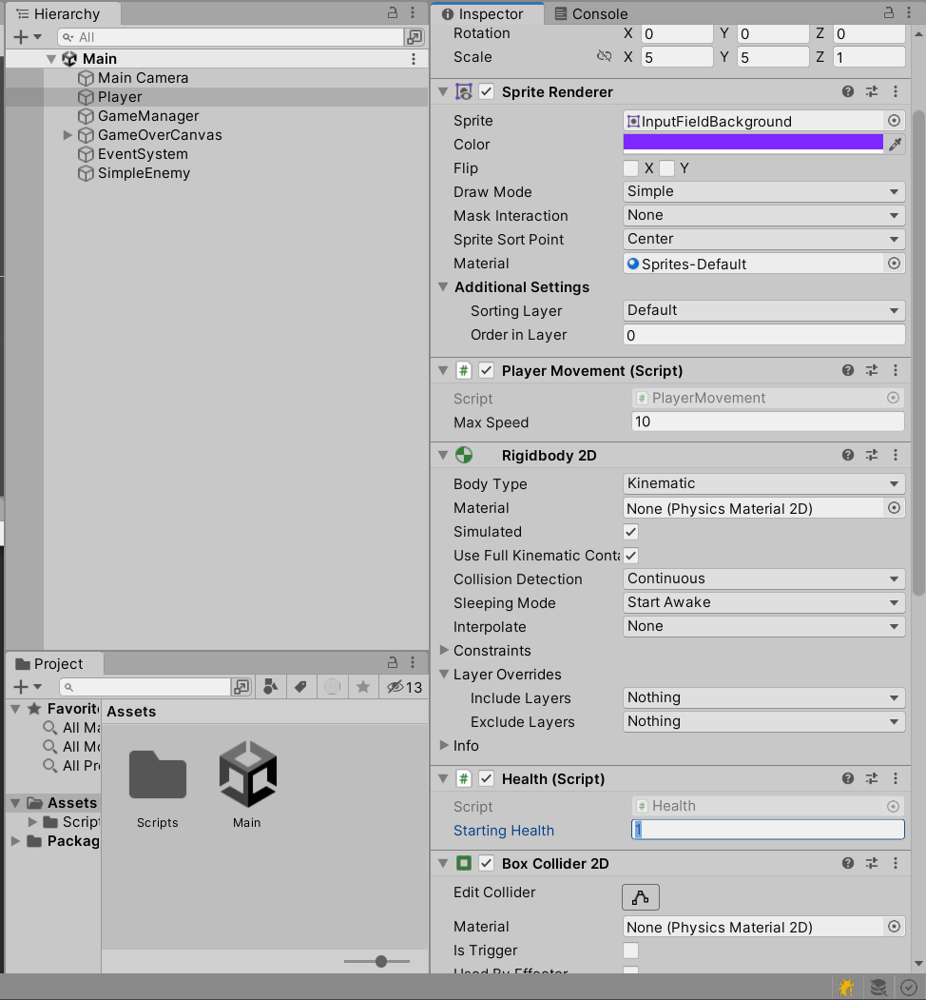
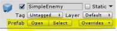
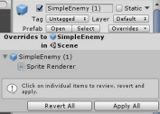
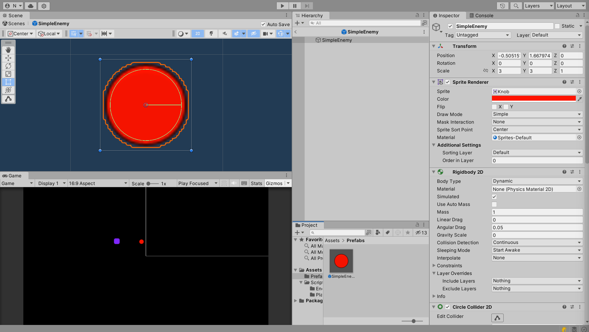
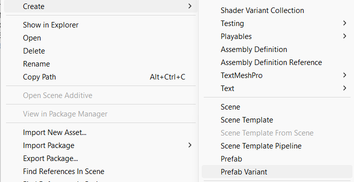
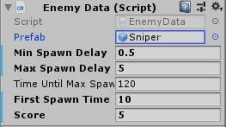
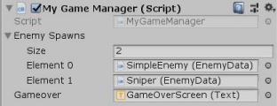

# Lab 2: Basic Scripting
{: .no_toc }

## Table of contents
{: .no_toc .text-delta }

1. TOC
{:toc}

**NOTE**: Please download this lab before starting! (You can also clone the repository if you're familiar with GitHub)

[Download Lab 2](https://github.com/berkeleyGamedev/BasicScriptingLab/archive/refs/heads/master.zip){: .btn .btn-blue }

## Lab Introduction

In this lab, you will gain a surface level introduction to programming by interpreting and editing elements of pre-written scripts. You will not be required to create any scripts for this lab.

You will be adding a new enemy type to a simple minigame, converting both enemy types into Unity Prefabs, and then spawning your enemy Prefabs into the minigame.

Upon completion of this lab, you should have a basic understanding of what variables are and of potential ways to modify them. You will also learn how to create and edit Prefabs in Unity. Programmers will learn about variable protection levels and gain a surface level introduction to how different types of scripts interact with each other

## Lab Instructions
### Editing Scripts
Select the Main scene from the Assets folder in the Project tab. The image on your screen should match the one seen in the image below.
- Notice that the Player GameObject under Main in the `Hierarchy` tab corresponds to the purple square, while the SimpleEnemy GameObject corresponds to the red circle.

Press play and observe how the game currently plays. Use WASD or the arrow keys to move the Player around.
- If the SimpleEnemy object touches the Player, the game should end.

In order to make this rather dull minigame more interesting, we will add multiple enemies and ensure that the player can survive more than one hit before dying.

Open the Scripts folder, located under Assets in the Project tab. Navigate to the Player folder, find the script called **Health**, and double click to open it.

You should see several lines of code similar to the ones transcribed below. Read the section indicated below.

        public class Health: MonoBehaviour {

        /// Non-programmers only need to look between >>>>> and <<<<<

        /// >>>>>

        // Most scripts will have a collection of Variables at the top. 
        Similar to their function in mathematical equations, a variable is a 
        name that is associated with a value. In this example, the variable 
        startingHealth is set to a value of 1. Following the variable is 
        a comment that explains its purpose. Variables preceded by the keyword 
        public will show up in the Inspector tab when you attach this 
        script to a GameObject in the Hierarchy tab.

        public int startingHealth = 1; 
        // This is how much health you have before you die 
        // <<<<< Non-programmers may stop reading here 

        int currentHealth;

        }

In addition to the **public** keyword used in the code block above, several other **variable protection levels** exist in programming:

- **Private** — The default setting, meaning that no other script may access this variable (including child scripts).
- **Public** — All scripts may access this variable. Additionally, it will show up as a field in the Inspector tab when this script is attached to a GameObject.
    - If you require a variable to be public but **not** show up in the Inspector, type **HideInInspector** before the variable declaration or on the line above it. 
- **Protected** — Only child scripts may access this variable. No other scripts can.

Each GameObject with the Health script attached to it will have its own copy of the variables declared within the script (unless the variables are preceded by the keyword **static**). Public variables will remain set to their default values unless set to another one via the Inspector. **Inspector changes to public variables will override values set in scripts.**

We will now modify the **startingHealth** variable in the Inspector in order to allow our Player to survive more than one hit.

- Exit out of this script and return to Unity, then select the Player GameObject in the Hierarchy. In the Inspector, displayed in the image below, locate the component titled **Health (Script).** The component should have only one modifiable field, titled **Starting Health.** Change this value to any number greater than 1.

***Checkoff Requirement:*** The Player should be able to survive more than one hit from an Enemy.

## Prefabs
### Creating Prefabs
A **Prefab** is a predefined GameObject that is saved as an **Asset**, in a manner similar to how one would save a script or an art asset. Prefabs are created by dragging an existing GameObject from the `Hierarchy` into the `Project` tab. Once a Prefab has been created, you can repeatedly drag it from the `Project` tab into the `Scene` in order to create multiple copies of the object.

- Create a Prefabs folder within your Assets folder. Drag the **SimpleEnemy** GameObject from the Hierarchy into this new folder to create a new Prefab.
- Drag the SimpleEnemy Prefab into the Scene to instantiate a new SimpleEnemy.

Notice the following:
- All instances of a Prefab have the same name and are numbered in order of creation.
- All instances of a Prefab are highlighted blue in the Hierarchy.
- When you click on a Prefab in the Hierarchy, the Inspector should display an additional tab labeled Prefab. 

### Editing Prefabs

You may frequently want to apply edits you make to a single Prefab across all Prefab instances (e.g. changing the color of all SimpleEnemies to be blue instead of red). Here are two ways to accomplish this:
1. Edit an instance of the Prefab in the Scene tab, then apply the change across all Prefab instances. 
    - Make a change to an instance of your Prefab.
    
    

    - Select the drop-down menu labeled “Overrides”.
    - Select “Apply All” to update the Prefab to match your current instance.

2. Edit the base Prefab in **Prefab Mode**, which will automatically apply your update across all currently instantiated Prefabs. 
    - Open the Prefab base in Prefab Mode.
    - Make a change to the base Prefab.
    - As long as the “Auto Save” toggle is on, your changes will automatically be applied across all instances of the Prefab. If not, press the “Save” button to apply your changes.
    

3. Make the default color of all SimpleEnemies blue using the first method (editing the **SpriteRenderer** component’s color field). Verify that your changes have been applied by instantiating a new SimpleEnemy afterwards.

***Checkoff Requirement:*** All instances of SimpleEnemies should be blue.

### Spawning Prefabs

Select the **GameManager** object from the Hierarchy tab and edit the **My Game Manager (Script)** component in the following ways:

- Expand the dropdown menu for **Enemy Spawns** by clicking the arrow on the left.
- Change the size from 0 to 2 (this is in order to make room for our next Enemy type).
- Drag the SimpleEnemy Prefab you created onto **Element 0** (or add it by clicking the circle located to the right of the word “Prefab”).

Verify that when you press play, SimpleEnemies continue to spawn indefinitely.

### Creating Prefab Variants

Delete all SimpleEnemy instances (every SimpleEnemy object in the Scene/Hierarchy), but **do not delete the Prefab asset that you created in the Prefab folder.**

***Checkoff Requirement:*** No Prefab instances should exist in the Scene.

We will now add a new enemy type to our minigame.

Right-click the Prefab asset in the Project tab and Navigate to `Create > Prefab Variant`. Rename this variant to “Sniper”.

Make the following changes to the Sniper Prefab using Prefab Mode (the second method in the “Editing Prefabs” section):
- Change the color of the SpriteRenderer component to whatever color you’d like.
- **Do not remove the SimpleEnemyMovement Script.**
- Change the damage field on the **Attack** component to a value of 2.
- Select **Add Component** and search for **Sniper Movement.**
    - Set the speed field to a value of 16 and the spawn distance field to a value of 10 (you’re welcome to experiment with different values if you would like).
    
    
    
- Modify all variables in the **Enemy Data (Script)** component to match Figure 7. For a more detailed description of the purpose of each variable, read the comments located in the scripts. 

***Checkoff Requirement:*** The Sniper enemy type should have a unique color.

***Checkoff Requirement:*** The Sniper enemy type should begin spawning at 10 seconds.

Select the GameManager object from the Hierarchy tab and edit the **My Game Manager (Script)** component to add the Sniper to the GameManager:

- Drag your new Sniper Prefab onto Element 1 **0** (or add it by clicking the circle located to the right of the word “Prefab”).

Verify that your My Game Manager component matches the photo below.

### Debugging
Press Play and notice the odd behavior of the Snipers. Their movement may be erratic (jittering and stuttering), or they may rush toward the Player at impossibly high speeds.

Go to your new Sniper prefab and remove the **Simple Enemy Movement** component.

Save the prefab and start the minigame. You should now observe that the Snipers spawn heading initially towards the Player, but proceed in a straight line rather than following the Player.

***Checkoff Requirement:*** The Sniper enemy type should have a different movement pattern from the SimpleEnemy. 

Open the scripts **MyGameManager.cs** and **EnemyData.cs.** These scripts combine a few different methods of making the Inspector for a script more useful:
- **HideInInspector** –– Use this if you require a variable to be public (for example, in a struct or an array) but don’t want it to show up in the Inspector
- Structs — Use these to create convenient groupings of variable names that will **remain** grouped in the Inspector
- Arrays/Lists — Use these to make adding more elements to your game more convenient. Rather than having to add a new public variable for each enemy type, this allows you to add a new enemy entirely in the Inspector.

Take a look at the relationship between **EnemyMovement.cs**, **SimpleEnemyMovement.cs,** and **SniperEnemyMovement.cs.** This is an example of how to utilize **Inheritance** (a concept you may be familiar with if you’ve taken CS61B)

- The **protected** keyword is important here.
- Functions that you intend to override must be visible to the child script (public or protected) as well as **meant** to be overridden (virtual or abstract).
- When a child class overrides a method, you must use the keyword **override**.
- When you override a method, it is good coding practice to call the parent method by using **base.methodName()**, wherein **base** refers to the parent class.
- Note that we separated Player and Enemy movement into different scripts; there are not many shared elements between them in the case of our minigame.

Notice how **Health.cs** and **Attack.cs** interact. This is an example of how to utilize the concept of **Composition**. 

- When an object with the Attack script attached comes into contact with another object, it will check to see if that object has a Health script. If it does, it will call that Health script’s takeDamage() function. It also checks to see if the health is less than or equal to zero, so that it can inform the GameManager that the game is over.
- **Composition** is the idea of building up behaviors through modular components. For instance, an enemy has a movement script and an attack script, and these scripts together make up the behavior of an enemy. In **Inheritance**, you build unique things up from the top down by adding new features to a parent class. In Composition, you build unique things from the bottom up by assembling different pieces together in order to achieve a desired behavior.
- Most games will utilize a combination of Composition and Inheritance.

## Summary

Congratulations! You have now successfully created a minigame with two different enemy types that will spawn in and attack your Player. You have also gained a better understanding of scripts, variables, and Prefabs — things that will be invaluable in your further exploration of Unity. If you would like more practice with these concepts, please take a look at the optional challenge tasks on the last page of this lab.

## Checkoff Requirements

1. The Player should be able to survive more than one hit from an enemy.
2. All instances of SimpleEnemies should be blue.
3. No prefab instances should exist in the Scene.
4. The Sniper enemy type should have a unique color.
5. The Sniper enemy type should begin spawning at 10 seconds.
6. The Sniper enemy type should have a different movement pattern from the SimpleEnemy.
7. You should have set up Unity Collab for this project and invited the decal staff account.

## Challenges (Optional)

Here are some additional, more challenging tasks if you’d like extra practice with Unity. Keep in mind that these tasks are much more open-ended than the ones covered in this lab — please do not hesitate to ask for help if you choose to explore one or more of them.

1. Add a new enemy type to the minigame.
    - Repeat the steps from the lab, but make a new movement or attacking script.

2. Polish the aesthetic of your minigame

    - Add art assets to the SpriteRenderer, rather than the simple polygons we’ve been working with. b. Add sound effects.

    - Look into particle effects and trail renderers.

3. Add a Player attack that can eliminate enemies.

    - [https://docs.unity3d.com/ScriptReference/Physics2D.CircleCast.html] 

    - The enemies currently have hitboxes known as **Triggers**. Any colliders can pass through a Trigger collider without any physics taking place, but a user-specified event will be triggered (similar to something like a sensor on a sliding glass door at a grocery store).

        - CircleCast will not detect Colliders that are Triggers; therefore, you will have to add another Collider to your enemies.

    - If you use the Health script that we provided, you will have to explore ways to make sure that the enemies are unable to attack each other.

        - Give the enemies a special tag or add them to a unique layer (found at the top of the Inspector). iii. Add a public variable to the Attack script that establishes what tag or layer the target must have in order to be attacked.

    - To avoid the enemies experiencing physics interactions with their new colliders, go to `Edit>Project Settings>Physics 2D` and view the Layer Collision Matrix. You can then specify which layers can collider with which layers.

## Bug Reports
If you experience any bugs or typos within the lab itself, please report it [here!]

[here!]: https://forms.gle/1C2GPHGDHCQo3WWe7 
[https://docs.unity3d.com/ScriptReference/Physics2D.CircleCast.html]: https://docs.unity3d.com/ScriptReference/Physics2D.CircleCast.html

[Lab 2 Repo]: https://github.com/berkeleyGamedev/BasicScriptingLab
