# Lab 3: Pixel Art and Spriting
{: .no_toc }

## Table of contents
{: .no_toc .text-delta }

1. TOC
{:toc}

## Overview

**Since this lab is relatively long and involves a lot of reading, tasks you should complete have been marked in ​BLUE ​to make them easier to spot.** ​Most of this lab will go over pixel art fundamentals, and there will be a task at the end for you to practice using the fundamentals. Don’t skip the reading, because you’ll be asked to explain your choices later. 

### Tools & Software
This lab will be in **​Photoshop**​ since it's free for students and has powerful editing and color correcting features that are useful for tweaking pixel drawings after they’re done.  
If you are comfortable in another pixel art software, you may use that software for the task portion of this lab, but Photoshop is strongly recommended for its versatility. **​If you do not yet have Photoshop downloaded, head over to ​https://software.berkeley.edu/adobe​ and read on as you wait for the download to finish. Otherwise, if you already have Photoshop, you’re good to go!** 

For those interested, there are a few other lightweight software options for pixel art, listed below: 
- [Aseprite] ($14.99)
- [PyxelEdit] ($9.00)
- [Piskel] (Free, online)
- [Medibang] (Free, online)

### Note: Canvas Size

To make scaling pixel art up and down easier, as well as to enable compression and optimization at a game engine level, the standard is to keep canvas dimensions for pixel art **powers of two​.** Some commonly used dimensions are: 
- 32 x 32
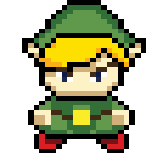
- 64 x 64

- 128 x 128
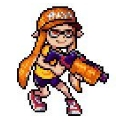
- 256 x 256
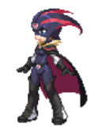
- 512 x 512
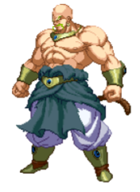

## Tips and Techniques

Pixel art is one of the most accessible forms of art because instead of relying on hand-eye coordination or a sense of artistic intuition, a lot of it simply relies on **​knowledge and understanding**​ of what makes ​low-resolution art ​ ​specifically ​ look enticing. Here are some tips and tricks to keep in mind when you make pixel art.  

### Dithering
Dithering is the simulation of a gradient with often very ​few ​colors. Using different dithering patterns you can create a pleasing transition between two colors. Since limited palettes are encouraged in pixel art, dithering is extremely helpful and almost always used in every piece. 

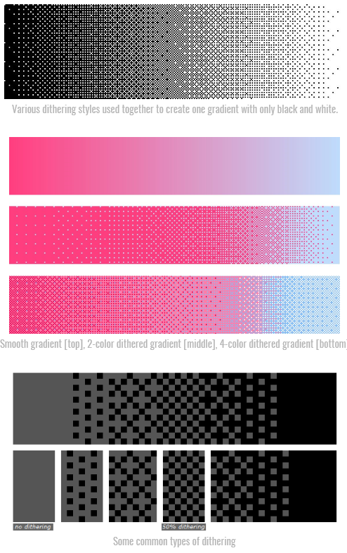

#### Dithering with Photoshop Brushes

While dithering can be done by hand, photoshop has third-party brushes that make the task a little bit quicker. You can find them here: [​https://abductedplatypus.itch.io/dither-brushes] 
*Note*:​ Each brush is titled by the pixel “channels” it covers. So, a brush labeled “AB” will conflict with a brush labeled “B”, since they both occupy the “B” channel, and one brush will always paint over the other one. Basically, in the words of the creator, to use the brushes without conflict, it’s useful to assign to each color either to OABC or DEFG brushes, since this will make it easier to dither with 3 or more colours. 

### Anti-Aliasing
Anti-aliasing is a stylistic choice​ ​used to make your pixel art look smoother when zoomed out by using gray pixels to fill in sharp edges​. ​Some pixel artist traditionalists disparage anti-aliasing, while others use it generously for smoother-looking lines. In general, NOT using anti-aliasing will make your pixel art look ​more old-school, lower definition, and more “pixely”. ​In contrast, using anti-aliasing will give the illusion of ​higher resolution artwork and smoother lines/color transitions. ​Which style you prefer is purely up to you and your vision for the game. 

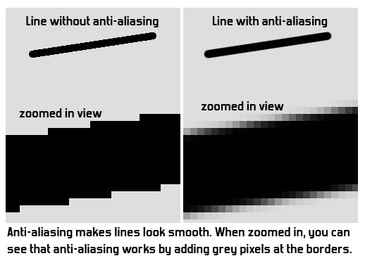

### Pixel Clusters
Pixel clusters are ​groups of pixels of the same color​ that together produce a solid color field. Think of it as an area filled in with a solid color by the paint bucket tool. While this may seem obvious, it is easy to get lost in dithering and blending and end up with too much fine detail and noise and lose the benefits that clusters bring. 

Pixel clusters serve two purposes: 
1. Anti-noise
    - Clusters provide areas of stability 
    - Brightness and colors are exponential in nature; a group of various pixels is easily dominated by the strongest one(s), often producing a noisy appearance

    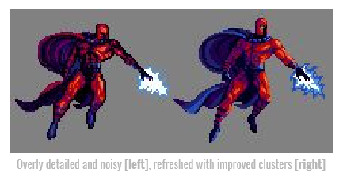

2. Aesthetics
    - Clusters are visually and geometrically pleasing 
    - On one hand they provide order & structure, on another they mimic the organic broad strokes of a brush 

### Jaggies
There are two common types of jaggies: corners and curves.

1. Corners:
    - When you quickly draw a pixelated line, every pixel in that line is ​directly adjacent​ to another pixel, so there are no ​“diagonals”​ and the line looks thick, uneven, and jagged. Going back in with an eraser to fine tune the line makes a very noticeable difference. 

    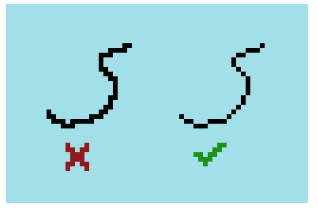

2. Curves:
    - For a line to be read as a “curve”, the spacing of the pixels must be very symmetrical and mathematical. Otherwise the line reads awkwardly and looks messy. 

    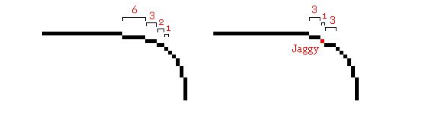

### Pillow Shading
Pillow shading is shading from the outline inwards, with the colors getting progressively lighter as they move to the center of the sprite. Try to avoid this as it usually looks unrealistic. Instead, choose a light source direction, make that the lightest point, and shade outwards from there. 

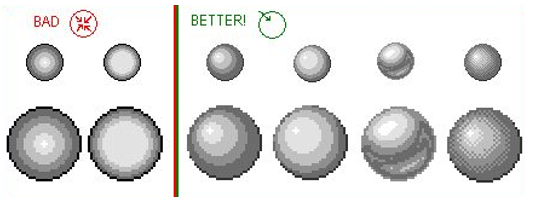

## Your Task

Finally - with these resources in mind, your task is to create a single pixel rendition of this character:

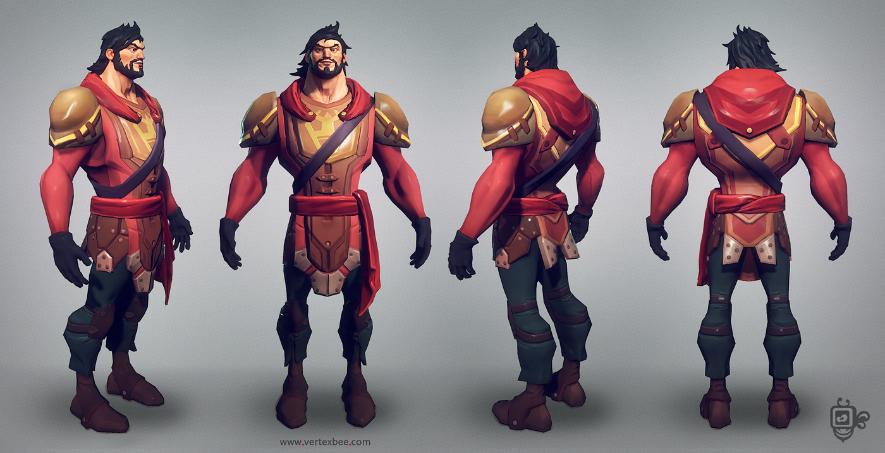

To add some life, use some sort of pose.​ ​It can be simple, as long as the character isn’t in the same generic pose as the reference image. For example:

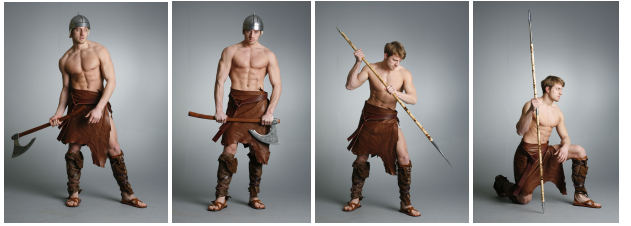

Pointers:

- Feel free to give the character a weapon or shield if you want.
- Don’t forget the techniques mentioned in this lab!
- You won’t be able to get ​all ​ the character’s details in, since pixel art is lower resolution. Just pick and choose the most characteristic ones!

## The Workflow

This is an optional generalized guide to help you through the process if you feel lost and don’t know where to start. Feel free to use this as a guide or skip it entirely. 

1. Sketching & Outlining
    - A common technique is to **​start with a large canvas**​ and roughly sketch the character, then **​shrink the canvas down**​ to its final pixel size using “nearest neighbor” interpolation, then fix the lines manually, keeping in mind the key principles. 
2. Coloring
    - Once you’ve outlined your character, try to **​stick to a limited palette**​ to make things easier on yourself (and usually more visually pleasing) 
    - These sites can be good places to start:
        - [Paletton]
        - [color-hex]
    - Remember to **​dither** ​your colors when you want to blend them together 
    - Don’t use all colors in equal amounts! Divide them into **​main (60%), secondary (30%), and accent (10%)**​ to reach a good balance, like below.

    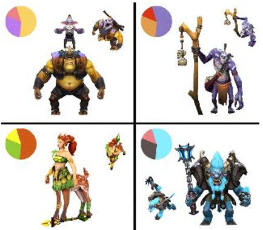

    - Try to **​avoid​ ​darkening with black ​and ​lightening with white.** ​This usually looks unrealistic, since light in real life is rarely pure white light!​ ​For example, try **purple-ish tones as shadows** ​and **​light​ ​yellow/orange-ish tones as highlights.**  

3. Polishing
    - Adjustment layers are super great! In particular, try out: 
        - Color balance (Playing around with this always​ ​makes things look better) 
        - Curves
        - Hue & Saturation
    - You can also make a new layer **​on top of all your other layers**​, make a gradient out of semi-bright colors, and set the layer’s ​**blending mode to Overlay.** ​Lower the layer’s opacity until it’s not too obnoxious and it will usually help your art look more pleasing. 

## Supplementary Lecture

If you feel like a brief (6 min) demonstration would be helpful, check out a supplementary lecture at [https://youtu.be/v999BHLsPlM]. This video provides a rundown of the process from sketch to polish, with accompanying explanations for each step. 

## Check-Off

Show off your finished pixel character rendition. Mention and briefly explain at least two techniques that you used. 

## Resources

[Pixel Join Forum] - Where most of the information from this lab was pulled from. A solid resource to check in with when in doubt.

[Pixelation​] - A great community of pixel artists, excellent for general knowledge and finding resources

[aP's Dither Brushes] - Dithering brushes for Photoshop

[Todo Asano​] - Twitch streamer who often streams drawing pixel art, good for ideas and inspiration

[Lospec] - Online tools for people creating pixel art and other restrictive digital art

## Bug Reports
If you experience any bugs or typos within the lab itself, please report it [here!]

[here!]: https://forms.gle/oiyM6iu3MinHfmNc7 
[Pixel Join Forum]: http://pixeljoint.com/forum/forum_posts.asp?TID=11299
[Pixelation​]: https://pixelation.org/
[aP's Dither Brushes]: https://abductedplatypus.itch.io/dither-brushes
[Todo Asano​]: https://www.twitch.tv/todo_asano
[Lospec]: https://lospec.com/
[Aseprite]: https://www.aseprite.org
[PyxelEdit]: https://pyxeledit.com/
[Piskel]: https://www.piskelapp.com/
[Medibang]: https://medibangpaint.com/en
[Paletton]:http://www.paletton.com​/
[color-hex]:http://www.color-hex.com/color-palettes/