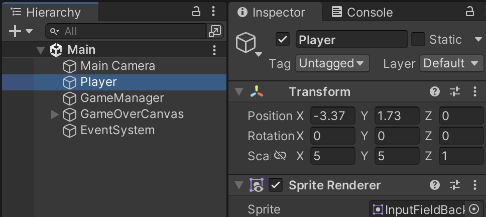
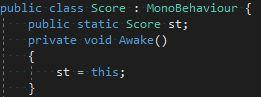
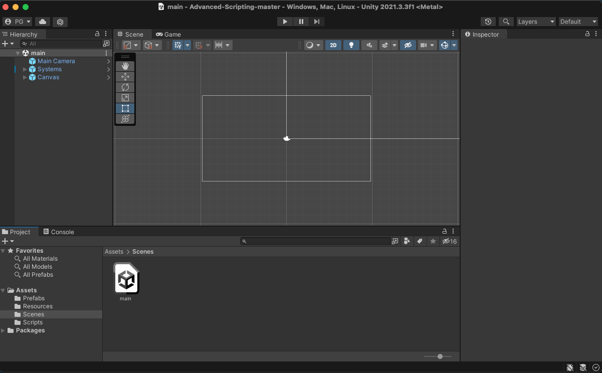

# Lab 4: Advanced Scripting
{: .no_toc }

For this lab you are going to create a lot from scratch. We provide a loose framework for the game, but you will create the enemies from scratch. Exciting!

## Table of contents
{: .no_toc .text-delta }

1. TOC
{:toc}

[Download Lab 4](https://github.com/berkeleyGamedev/Advanced-Scripting/archive/refs/heads/master.zip){: .btn .btn-blue }

## PREFACE
Before we begin, there are 3 concepts we want to make sure you understand. The lab will help to reinforce all three of these ideas.

### GetComponent and GameObject.Find
You almost certainly have run into at least one of these by now so I will keep it short.
[GameObject]
1. [Find()]  
    Returns a GameObject with the specified name

    
    - Ex: In the Basic Scripting Lab, the GameObject for the player in the scene was named “Player”. Thus, if we write  

            foo = GameObject.Find(‘Player’);  

        **foo** is assigned as a “pointer” to that GameObject instance
    - Note this method is static meaning it is accessed by calling  
    `GameObject.Find` (Note the capital G in GameObject!)
    - This method is considered inefficient. For the work you do in this class, optimization is not a big deal so using this method is  fine. If you do want to try optimizing, you could potentially call this method once in the `Start()` method and then store a  reference to what you found in the script
    - **More commonly used is `GameObject.FindWithTag()`, to avoid having to change your code if you decide to rename a GameObject in the Inspector.**
2. [GetComponent()]  
    Returns the type of the Component that was specified. Called on GameObjects.
    - Ex: If you want to change the color of your purple player square to red while the game is running, you could type the following:  

            foo = GameObject.Find(‘Player’)  
            if (insert some condition here) {  
                sr = foo.GetComponent<SpriteRenderer>();  
                sr.color = new Color.red;  
            }

    - Not static and **must be called on a GameObject instance** (Pretty much anything in Unity)
    - To access the GameObject that your script is attached to you can simply use the keyword **gameObject**
        - Ex: if you have a Health script attached to your player GameObject, and you want to change the player’s color to red directly **from within the Health script**, you can type the following:

                gameObject.GetComponent<SpriteRenderer>.color = new Color.red;

    - Similarly for the Transform you can just use the keyword **transform**
    - The syntax for the GetComponent method is as follows: `GetComponent<Class or Component Name>()`. It is a little odd coming from coding in Java, but you can think of it as both Casting and passing in a parameter of which Component to look for
    - This method is also considered inefficient. The same can be said here as was said about **Find()**
3. [SetActive()]
    - Nice way to turn off GameObjects (or components) while the game is running by passing in **False**
    - Generally preferred to outright **Destroy**ing GameObjects, because you can’t un-**Destroy** GameObjects, and **Destroy**ing may mess up interactions with other scripts
    - Ex: if you want to turn off your player when getting killed you would use something like:
	`gameObject.SetActive(False);`  

We encourage you to explore the linked Script References. There are a lot of similar methods that we will not be covering that you may find useful!

### Singletons
A singleton, as you may or may not have learned from other classes, is an object that there is only one of. This is a really useful model for **centralized systems** in your game. Some good examples of scripts where this may be useful include: *SpawnManager, PlayerData, LevelLoader* (These are made up names to get the idea across). So how do we make a singleton? Easy!

  
Let’s break this down.
- First off this is not a true singleton in that you could technically make more of them by attaching this script to more objects, but this does not matter for our use case
- Public means all scripts anywhere can access this variable
- Static means all Score script objects share the same **st** variable
    - It also means you can access this shared **st** variable using **Score.st**
        - This is nice because there are no **GetComponent**s or **GameObject.Find**s required!
- **We do this in `Awake()` because `Awake()` is guaranteed to happen before `Start()` which is a place where this singleton might get used**
    - If another script tries to reference **Score.st** from within an `Awake()` there is no guarantee that **Score.st** will be assigned yet!!! (It will only work sometimes)
- We use a short variable name (**st** short for singleton in this case) to make future uses in other scripts cleaner and easier to read

Now when another script wants to modify the score they can simply say

        Score.st.addScore(9001);

Instead of

        Score scoreObj = GameObject.Find(“Score”).GetComponent<Score>(); scoreObj.addScore(1337);

### Time.deltaTime
- [Time.deltaTime]
    1. This is the amount of time that elapsed since the last frame
    2. I often find it useful to have countdown timers for things like cooldowns or enemy spawns
        - Set the variable to the total time you want to wait
        - Then subtract **Time.deltaTime** in each call to `Update()`
        - Once it reaches 0, restart the timer (if applicable)
        - Then do whatever action you were waiting to do
- [Time.fixedDeltaTime]
    1. This is the amount of time between physics updates
    2. Unlike **Time.deltaTime**, this value is consistent throughout your game
    3. Whenever you use a physics method such as `FixedUpdate()`, you should be using this value instead of **Time.deltaTime** to avoid unwanted behavior

### Misc Tips
- Don’t feel too overwhelmed by some of the crazy syntax and differences in C#, you can get really far by just pretending its Java and ignoring the new stuff
- Don’t forget the tips from the last scripting lab! It covered ways to get more out of the Unity Inspector for your script (among other things):
    1. Structs
    2. Arrays/Lists
- There are several ways that your code might start running, the main ways are
    1. Through a [MonoBehavior Event]
        - These include events such as `Start()`, `Update()`, `FixedUpdate()`, `OnMouseDown()`
    2. Or through an external method call
        - GUI button press set to call a method, another script calling one of your public methods, etc
- [This is an extremely useful chart of what order things run in]
    1. Scroll to the bottom of the page

### Organization and Practices
1. When writing a lot of code, you want to try your best to keep it organized and clear
2. Decide on a naming convention to differentiate script variables from local function variables. Personally, I will preface any script variable with an m_ and leave it out from local function variables. So instead of score, I would use **m_Score**.
3. Keep ALL variables and functions private. There are very few reasons to make variables public. If you go through the delegates and events lab, there will be exceptions there. Certain functions need to be public as well (`AddScore()`).
4. If you need to edit a variable in the editor, instead of making it public, give it the **\[SerializeField\]** heading AND a **[Tooltip(“explain what this variable is here”)]**
5. Try your best to group different functions together and then use:  
        #region Region Name  
        #endregion  
    to group these functions together
6. Use short accessors and mutators
7. Generally, use the **\[DisallowMultipleComponent\]** (with brackets) because you would rather be safe than sorry; this header will ensure that you do not place the same script twice on the same object
8. Use the **\[RequireComponent(typeof(ENTER_TYPE_HERE))\]** header as well whenever you use the function `GetComponent<>()`
9. You will find examples of each of these points in the scripts of this lab  

Do not worry if you don’t know what some of these things mean. As you go spend more time in Unity, this section will make a lot more sense. For now, use **REGIONS** as your main organizational tool.

### Useful Scripting Reference links
- [Mathf]
- [Instantiate()] (used for prefabs mainly)
- [Vector2], [Vector3], [.normalize()], and [.normalized]
- [BoxCollider2D]
- [Rigidbody2D] (Used for physics-based movement)
- [Transform]
- [SpriteRenderer]

## The actual lab assignment!
**BEFORE YOU START: Make sure your screen looks like this picture. If it doesn’t, go to File > Open Scene > Scenes > Main.unity**

  

Sorry for the essay above, there is a lot to cover.

For this lab we have a few systems in place. (Open the Systems prefab to examine them)
1. **MouseInput**: tracks the mouse input and acts as an attack where the mouse left clicks.
2. **Score**: updates the score and changes a very simple UI.

**YOUR TASK:**  
Your task will be to create the enemies from scratch.

You can think of this game as essentially Fruit Ninja. You click on the screen to clear enemies in a certain area but you don’t want to hit the bombs.

### Checkoff (Feel free to surpass these)
- A functioning minigame that is mechanically similar to Fruit Ninja (in the loosest sense)
- 2 enemy types
    - One that you want to hit, one that you don’t
- Score integration (use Score.st.addScore())
- A functioning spawn system
- Mouse attacks should kill enemies
- And ensuring everything is organized (the enemy script in particular)!
    - Use regions
    - Variables and functions should be kept private
    - Variables that can be edited in the editor should have a tooltip

You have a lot of creative freedom here. You can take that and run with it or you can follow the more chunked up, bare minimum steps below.

### Creating the Enemies
- Create a serializable variable named despawnTime. This determines how long an enemy will stay active if the player doesn’t click on it. Give it a value in the inspector.
- In the Update function, compare the despawnTime with the elapsedTime to determine whether or not the enemy should be active.

First off, we need an enemy to interact with.
- In the Hierarchy window, right click and select *2D Object* > *Sprites > Square (or Circle)*
- Edit the sprite using the **SpriteRenderer** component if you want
    - Click the circle next to *Sprite* in the inspector
- Adjust the scale of the transform to your liking
- *Add Component* > *Box Collider 2D (or Circle Collider 2D)*
- If you want your enemy to have physics based movement/gravity then add a *Rigidbody2D* Component as well. **HOWEVER**, the rest of these tips will assume you didn’t do this
- Make it a Prefab so you can spawn copies of it later
    - As a reminder, prefabs are like GameObject “templates”, they are very useful because scripts can reference them
    - Just drag it into your Prefabs folder

Now we need the enemy to move (Or not, that’s up to you. But it should at the very least spawn in a random location and despawn after some time has passed)
- Right click the *Assets tab Create* > *C# Script* (name the script ‘Enemy’). Open the script
- In the **Start** function, find some satisfiable way to move the enemy to a good spawn location. I recommend using something like

        transform.position = new Vector2(Random.Range(-horizontalBound, horizontalBound), Random.Range(-verticalBound, verticalBound));  

    - For the purpose of this lab you can just hard-code values for **horizontalBound** and **verticalBound**
        - In a real game you would want to figure out how to do this dynamically (just google it), but it is not worth doing for this lab
        - There are two versions of **Random.Range**, one for floats and one for integers. Make sure you use the one for floats
        - You can keep track of **elapsedTime** with:

                elapsedTime = elapsedTime + Time.deltaTime;

        - You will need to create 3 new variables if you choose to follow the above:
            - **startingPosition** should be a Vector2 that is set to your **transform.position** in Start AFTER you reset **transform.position** to a random spot
            - **elapsedTime** should be a float that is set to 0 when the enemy is initialized
            - Create a serializable variable named **despawnTime**. This determines how long an enemy will stay active if the player doesn’t click on it. Give it a value in the inspector.
        - In the Update function, compare the despawnTime with the elapsedTime to determine whether or not the enemy should be active.

- Make sure to attach the script you made to your enemy!!!

Repeat the above steps for the second enemy type (Or just copy and paste and change the **SpriteRenderer** color and make a new prefab for it)

### Programming Mouse-click and Score Functionality
Now that we have an enemy to hit, go into the MouseInput script and add some code to deal with when the player clicks on an enemy
- The easiest thing to do would be to check whether it is a good or a bad enemy
    - For this we recommend using the *Tag* field at the top of the inspector. You can access the **Tag** in script with `gameObject.tag`
        - A **Tag** is just a way of grouping GameObjects essentially for purposes exactly like this
        - **Layers** also group GameObjects but are also used when rendering or calculating collisions
- If it is a good enemy, call `Score.Singleton.AddScore(10);`
- If it is a bad enemy, call `Score.Singleton.AddScore(-10000);`
    - Or you could find some more elegant way to end the game, but this will suffice for the lab
- Then, delete the enemy

### Spawning Enemies

Now we have to spawn the enemies! Open up the SpawnManager script and fill in the appropriate functions. Finally, stick this SpawnManager script on an object in the scene that will NOT be destroyed (like an empty game object that just exists to spawn stuff).

You did it! Congratulations! As a challenge, try and go back and improve things as much as you can :D

********************************************************************************************************

### Appendix: Unity Script Organization

I keep my scripts organized using the following Region Headers. The bolded headers are ones that you will see in this lab (and you will probably want to use these). If you have any questions about any of them, feel free to ask.

Delegates and Events  
**Editor Variables**  
**Non-Editor Variables**  
**Cached Components**  
Cached Instance References  
**Singletons**  
**First Time Initialization and Set Up**  
OnEnable, Set Ups, and Resetters  
**Main Updates**  
Game Loop Updates  
OnDisable and Other Enders  
**Accessors and Mutators**  
Getters  
Checkers and Verifiers  
Collision Methods  
Unity Misc  
**Script Specific Headers**

## Bug Reports
If you experience any bugs or typos within the lab itself, please report it [here!]

[https://github.com/berkeleyGamedev/Advanced-Scripting]: https://github.com/berkeleyGamedev/Advanced-Scripting
[here!]: https://forms.gle/1C2GPHGDHCQo3WWe7 
[GameObject]: https://docs.unity3d.com/ScriptReference/GameObject.html
[Find()]: https://docs.unity3d.com/ScriptReference/GameObject.Find.html
[GetComponent()]: https://docs.unity3d.com/ScriptReference/GameObject.GetComponent.html
[SetActive()]: https://docs.unity3d.com/ScriptReference/GameObject.SetActive.html
[Time.deltaTime]: https://docs.unity3d.com/ScriptReference/Time-deltaTime.html
[Time.fixedDeltaTime]: https://docs.unity3d.com/ScriptReference/Time-fixedDeltaTime.html
[MonoBehavior Event]: https://docs.unity3d.com/ScriptReference/MonoBehaviour.html
[This is an extremely useful chart of what order things run in]: https://docs.unity3d.com/Manual/ExecutionOrder.html
[Mathf]: https://docs.unity3d.com/ScriptReference/Mathf.html
[Instantiate()]: https://docs.unity3d.com/ScriptReference/Object.Instantiate.html
[Vector2]: https://docs.unity3d.com/ScriptReference/Vector2.html
[Vector3]: https://docs.unity3d.com/ScriptReference/Vector3.html
[.normalize()]: https://docs.unity3d.com/ScriptReference/Vector2.Normalize.html
[.normalized]: https://docs.unity3d.com/ScriptReference/Vector2-normalized.html
[BoxCollider2D]: https://docs.unity3d.com/ScriptReference/BoxCollider2D.html
[Rigidbody2D]: https://docs.unity3d.com/ScriptReference/Rigidbody2D.html
[Transform]: https://docs.unity3d.com/ScriptReference/Transform.html
[SpriteRenderer]: https://docs.unity3d.com/ScriptReference/SpriteRenderer.html