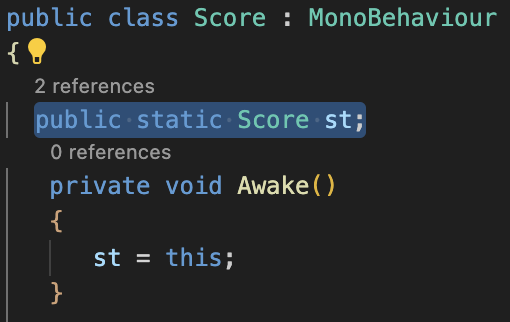

# Lab 4: Advanced Scripting
{: .no_toc }

## Table of contents
{: .no_toc .text-delta }

1. TOC
{:toc}

**NOTE**: Download the lab, unzip it, and open the project folder in Unity Hub!

[Download Lab 4](https://github.com/berkeleyGamedev/Advanced-Scripting/archive/refs/heads/master.zip){: .btn .btn-blue }

<!-- S: dropdown html w/ boarder cause I think it looks better :3 

How do I dropdown?

This is how you dropdown.

 -->

## Overview 
In this lab, you will create a mini-game loosely inspired by *Fruit Ninja*. While we will provide a basic framework for the game, you will have the opportunity to design and implement the enemies entirely from scratch. Exciting, right? 

## PREFACE
Before we begin, there are 3 concepts we want to make sure you understand. The lab will help to reinforce all three of these ideas. We highly encourage you to read through this section and explore the linked Script References. Even if you are already familiar with these concepts, we recommend reviewing the material, as it contains methods that you may find useful! 

### GameObject Methods
By now, you most certainly have encountered at least one [GameObject], so there's no need for a detailed explanation. 

If you need a quick refresher...

A GameObject is the fundamental building block in every scene. It could be anything from a character, a light source, or a spawn point. While the GameObject itself does not "do" anything, it serves as a "container" which you can attach various components. These components define its behavior, appearance, and functionality, as demonstrated by the following methods. 

1. [Find()]  
    Finds and returns a GameObject with the specified name.

    ||
    |:---:|
    |Lab 3: Basic Scripting|

    - Ex: In the previous lab, the GameObject for the player in the scene was named “Player”. Thus, if we write  

            foo = GameObject.Find(‘Player’);  

        **foo** is assigned as a “pointer” to that GameObject instance (highlighted in blue). 
    - This method is considered inefficient, but for this class optimization is not a big deal so using this method is fine. If you do want to try optimizing, you could potentially call this method once in the `Start()` method and then store a  reference to what you found in the script
    - **More commonly used is [GameObject.FindWithTag()], to avoid having to change your code if you decide to rename a GameObject in the Inspector.**

2. [GetComponent()]  
    Returns a specified GameObject component. 
    - Ex: During the gameplay, if you want to change the color of your purple player square to red, you could type the following:  

            foo = GameObject.Find(‘Player’)  
            if (insert some arbitrary condition here) {  
                sr = foo.GetComponent<SpriteRenderer>();  
                sr.color = new Color.red; 
            }

        - Not static and **must be called on a GameObject instance**. Typical usage for this method: 

                 ComponentType name = GameObject.GetComponent<ComponentType>();

    - To access the GameObject that your script is attached to you can simply use the keyword **gameObject**
        - Ex: if you have a Health script attached to your player GameObject, and you want to change the player’s color to red directly **from within the Health script**, you can type the following:

                gameObject.GetComponent<SpriteRenderer>.color = new Color.red;

    - This method is also considered inefficient. The same can be said here as was said about **Find()**

3. [SetActive()]
    - Activates or deactivates the GameObject locally. 
    - A nice way to turn off GameObjects (or components) while the game is running by passing in **False**. Generally preferred to outright destroying GameObjects, because you can’t un-[Destroy] GameObjects, and destroying may mess up interactions with other scripts. 
    - Ex: if you want to turn off your player when getting killed you would use something like:

	        gameObject.SetActive(False);

### Singletons
A singleton is an object that there is only **one** of. This is a really useful model for **centralized systems** in your game. Some good examples of scripts where this may be useful include: *SpawnManager, PlayerData, LevelLoader* 

So how do we make a singleton? Easy! Let’s break this down.

- First, this is not a true singleton because you could technically make more of them by attaching this script to multiple objects; however, this does not matter for our use case.
- **Public** means all scripts anywhere can access this variable
- **Static** means all Score script objects share the same **st** variable
    - It also means you can access this shared **st** variable using **Score.st**
        - This is nice because there are no **GetComponent**s or **GameObject.Find**s required!
- **We do this in `Awake()` because `Awake()` is guaranteed to happen before `Start()` which is a place where this singleton might get used**

{: .important}
>If another script tries to reference **Score.st** from within an `Awake()` there is no guarantee that **Score.st** will be assigned yet!!! (It will only work sometimes)

{: .note}
>We use a short variable name (**st** short for singleton in this case) to make future uses in other scripts cleaner and easier to read, but you can name it whatever you want.

Now when another script wants to modify the score they can simply say:

        Score.st.addScore(9001);

Instead of: 

        Score scoreObj = GameObject.Find(“Score”).GetComponent<Score>(); scoreObj.addScore(1337);

### DeltaTime
- [Time.deltaTime]
    1. This is the amount of time that elapsed since the last frame
    2. Countdown timers are useful for things like cooldowns or enemy spawns
        - Set the variable to the total time you want to wait
        - Then subtract **Time.deltaTime** in each call to `Update()`
        - Once it reaches 0, restart the timer (if applicable)
        - Then do whatever action you were waiting to do
- [Time.fixedDeltaTime]
    1. This is the amount of time between physics updates
    2. Unlike **Time.deltaTime**, this value is consistent throughout your game
    3. Whenever you use a physics method such as `FixedUpdate()`, you should be using this value instead of **Time.deltaTime** to avoid unwanted behavior

### Misc Tips
- Don’t feel too overwhelmed by some of the crazy syntax and differences in C#, you can get really far by just pretending its Java and ignoring the new stuff
- Don’t forget the tips from the last scripting lab! It covered ways to get more out of the Unity Inspector for your script (among other things):
    1. Structs
    2. Arrays/Lists
- There are several ways that your code might start running, the main ways are
    1. Through a [MonoBehavior Event]
        - These include events such as `Start()`, `Update()`, `FixedUpdate()`, `OnMouseDown()`
    2. Or through an external method call
        - GUI button press set to call a method, another script calling one of your public methods, etc
- [This is an extremely useful chart of what order things run in]
    1. Scroll to the bottom of the page

**Organization and Practices**
1. When writing a lot of code, you want to try your best to keep it organized and clear
2. Decide on a naming convention to differentiate script variables from local function variables. Personally, I will preface any script variable with an m_ and leave it out from local function variables. So instead of score, I would use **m_Score**.
3. Keep ALL variables and functions private. There are very few reasons to make variables public. If you go through the delegates and events lab, there will be exceptions there. Certain functions need to be public as well (`AddScore()`).
4. If you need to edit a variable in the editor, instead of making it public, give it the **\[SerializeField\]** heading AND a **[Tooltip(“explain what this variable is here”)]**
5. Try your best to group different functions together and then use:  
        #region Region Name  
        #endregion  
    to group these functions together
6. Use short accessors and mutators
7. Generally, use the **\[DisallowMultipleComponent\]** (with brackets) because you would rather be safe than sorry; this header will ensure that you do not place the same script twice on the same object
8. Use the **\[RequireComponent(typeof(ENTER_TYPE_HERE))\]** header as well whenever you use the function `GetComponent<>()`
9. You will find examples of each of these points in the scripts of this lab  

Do not worry if you don’t know what some of these things mean. As you go spend more time in Unity, this section will make a lot more sense. For now, use **REGIONS** as your main organizational tool.

**Useful Scripting Reference links**
- [Mathf]
- [Instantiate()] (used for prefabs mainly)
- [Vector2], [Vector3], [.normalize()], and [.normalized]
- [BoxCollider2D]
- [Rigidbody2D] (Used for physics-based movement)
- [Transform]
- [SpriteRenderer]

## The actual lab assignment!

{: .important}
> **BEFORE YOU START: Make sure your screen looks like this. 
>  If it doesn’t, go to File > Open Scene > Scenes > Main.unity** 

Sorry for the essay above, there is a lot to cover.

**YOUR TASK:**  
As mentioned earlier, you will be building a simplified version of the *Fruit Ninja* game: you click on the screen to clear enemies in a certain area, but you must avoid hitting the bombs.

### Checkoff 
**You are highly encouraged to surpass these requirements!**
- A functioning mini-game that is mechanically similar to Fruit Ninja (in the loosest sense)
- 2 enemy types
    - One that you want to hit, one that you don’t
- Score integration (use Score.st.addScore())
- A functioning spawn system
- Mouse attacks should kill enemies
- And ensuring everything is organized (the enemy script in particular)!
    - Use regions
    - Variables and functions should be kept private
    - Variables that can be edited in the editor should have a tooltip

For this lab we have a few systems already in place in `Assets > Prefabs > System` or . Take a look and figure out see each script works.  
1. **MouseInput**: tracks the mouse input and acts as an attack where the mouse left clicks.
2. **Score**: updates the score and changes a very simple UI.

**You have a lot of creative freedom here on out. You can take that and run with it or you can follow the more chunked up, bare minimum steps below.**

### Creating the Enemies
<!-- First off, we need a enemies to interact with. We will be creating two enemy types: a good and bad. If **the good Enemy** is clicked on, the player will be awarded with points, but if the player clicks on **the bad Enemy**, points will be deducted. Similar to Fruit Ninja, where you get points for slicing fruits, but lose the game if you hit a bomb. However, the point
- Create a serializable variable named despawnTime. This determines how long an enemy will stay active if the player doesn’t click on it. Give it a value in the inspector.
- In the Update function, compare the despawnTime with the elapsedTime to determine whether or not the enemy should be active. -->

A good place to start is to create our enemy prefabs. You'll need to design two types of enemies: a **GoodEnemy** which will award points, and a **BadEnemy**, which will deduct points (or end the game). 

1. In the Hierarchy window, right-click and select `2D Object > Sprites > Square (or Circle)`. 
2. Use the **SpriteRenderer** component to customize it's appearance (e.g., color or texture). 
3. Adjust the scale of the transform to your liking.
4. To make our enemies intractable, allowing it to our mouse clicks `Add Component > Box Collider 2D (or Circle Collider 2D)`. 
    - **Optional Physics** If you want your enemy to have physics based movement or gravity, add a *Rigidbody2D* component. The rest of the tips will assume you did *not* do this, but it doesn't really matter. 
5. Make it a Prefab so you can spawn copies of it later.
    - As a reminder, prefabs are like GameObject “templates” that allow you to create reusable objects. 
    - To create a prefab, drag your enemy object from the **Hierarchy** into your **Prefabs** folder (refer back to lab 3 for a refresher if needed).
6. Repeat (or copy and paste) and you should have two *distinct* prefabs for each enemy type. 

Our current enemy prefabs don't actually do anything yet. So, the next step is to create and attach a script detailing our desired enemy behavior (e.g., moving around, chasing, or attacking the player). For this lab, at a minimum, both enemy types should **spawn** at a random location and **despawn** after some specified time has passed. 

1. Right click the Assets tab `Create > Scripting > MonoBehavior Script (name the script ‘Enemy’)`. Open the script.
2. Find some satisfiable way to move the enemy to a good spawn location. (Again, you have creative freedom here.)
     
    

    
Hint 1

    
To move to a spawn location, I recommend using something like: 

    
<code> transform.position = new Vector2(Random.Range(-horizontalBound, horizontalBound), Random.Range(-verticalBound, verticalBound));</code>

    For the purposes of this lab, you can hard-code values for <strong>horizontalBound</strong> and <strong>verticalBound</strong>. In a real game you would want to figure out how to do this dynamically (just google it), but it is not worth doing for this lab.
   
    
<strong>Random.Range</strong> has two versions--one for floats and one for integers. Make sure you use the one for floats.

    

    
Hint 2

     
    
If you use the approach above, you'll need a Vector2 variable <strong>startingPosition</strong>. Under the Start() method, set your <strong>startingPosition</strong> to the enemy's new position AFTER using <strong>transform.position</strong> to randomize the spawn location. 

    

    
Hint 3

     
    
 I found the ranges (-10,10) and (-5, 5) reasonable for horizontal and vertical bounds, respectively. 

3. Finally, you will need to implement some way to despawn the enemy after a specified amount of time has passed. 
    

    
Hint 1

    
To determine how long an enemy will stay active if the player doesn't click on it, create a <a href="https://gamedevbeginner.com/serialize-field-in-unity/#:~:text=Serialize%20Field%20is%20an%20attribute,be%20visible%20in%20the%20Inspector.e" target="_top">serializable variable</a> named despawnTime and give it a value in the inspector.
    

    
 You're also going to need a way to keep track of the amount of <strong>time</strong> that has <strong>elapsed</strong> since spawning...<em>hint hint</em>...

    

    
Hint 2

     
    
elapsedTime should be a float that is set to 0 when the enemy is initialized. You can keep track of elapsedTime with:

    
<code>elapsedTime = elapsedTime + Time.deltaTime;</code>

    

    
Hint 3

     
    
 In the Update() method, compare your despawnTime with the elapsedTime to determine whether or not the enemy should be active. 

    

    
Hint 4

     
    
 Remember to use the .SetActive() to despawn the enemy. 

With that, you've successfully created your enemies from scratch! However, you might notice that your enemies don't appear when you hit play. That is because we've only defined their characteristics and haven't yet implemented a spawning system that will bring them into the game. Let's tackle that next! 

{: .important}
>Make sure to attach the enemy script you made to your enemy prefabs!!!

### Spawning Enemies

Now we have to spawn the enemies! Open up the **SpawnManager** script and carefully review its contents. Take your time to understand what's going on as this will help you fill in the missing sections. 

Hint 1

  It might help to jump ahead a little to see how <em>exactly</em> SpawnManager functions in Unity. Create an empty game object in the Hierarchy and attach the SpawnManager script to it. In the Inspector, you'll see an empty list of Enemy Types.
  <ul>
    <li>Hover over Enemy Types, what does it say?</li>
    <li>Try assigning a value to Enemy Types. What do you see now?</li>
  </ul>

  
<strong> Enemy Types needs to be expanded to see this. </strong>

  

    
Hint 2

     
    

    

If you haven't already, attach this SpawnManager script on an object in the scene that will **NOT** be destroyed (i.e., an empty GameObject specifically to handle spawning). When you hit play, you should see both enemy types spawn and despawn at random locations. Feel free to experiment with despawnTimer, Spawn Rate, and other variables until you're happy with it.  

### Programming Mouse-click and Score Functionality
Final stretch! Now that we have an enemy to hit, go into the MouseInput script and add some code to deal with when the player clicks on an enemy. 
1. We need some way to distinguish the good enemy from the bad. 
    

    
Hint 1

    
We recommend using the <strong>Tag</strong> field. A Tag is essentially just a way of grouping GameObjects for purposes like this. To create Tags, select any prefab and in the Inspector <code>Tag > Add Tags... > Tags & Layers</code>

    
You can access the <strong>Tag</strong> in script with <code>gameObject.tag</code>

    

    

2. Now let's implement the scoring system. 
    - If it is a good enemy, call `Score.Singleton.AddScore(10);`
    - If it is a bad enemy, call `Score.Singleton.AddScore(-10000);`
        - Or you could find some more elegant way to end the game, but this will suffice for the lab
3. Then, delete the enemy. 

You did it! Congratulations! As a challenge, try and go back and improve things as much as you can :D

********************************************************************************************************

### Appendix: Unity Script Organization

I keep my scripts organized using the following Region Headers. The bolded headers are ones that you will see in this lab (and you will probably want to use these). If you have any questions about any of them, feel free to ask.

Delegates and Events  
**Editor Variables**  
**Non-Editor Variables**  
**Cached Components**  
Cached Instance References  
**Singletons**  
**First Time Initialization and Set Up**  
OnEnable, Set Ups, and Resetters  
**Main Updates**  
Game Loop Updates  
OnDisable and Other Enders  
**Accessors and Mutators**  
Getters  
Checkers and Verifiers  
Collision Methods  
Unity Misc  
**Script Specific Headers**

## Bug Reports
If you experience any bugs or typos within the lab itself, please report it [here!]

[https://github.com/berkeleyGamedev/Advanced-Scripting]: https://github.com/berkeleyGamedev/Advanced-Scripting
[here!]: https://forms.gle/oiyM6iu3MinHfmNc7 
[GameObject]: https://docs.unity3d.com/ScriptReference/GameObject.html
[Find()]: https://docs.unity3d.com/ScriptReference/GameObject.Find.html
[GetComponent()]: https://docs.unity3d.com/ScriptReference/GameObject.GetComponent.html
[SetActive()]: https://docs.unity3d.com/ScriptReference/GameObject.SetActive.html
[Time.deltaTime]: https://docs.unity3d.com/ScriptReference/Time-deltaTime.html
[Time.fixedDeltaTime]: https://docs.unity3d.com/ScriptReference/Time-fixedDeltaTime.html
[MonoBehavior Event]: https://docs.unity3d.com/ScriptReference/MonoBehaviour.html
[This is an extremely useful chart of what order things run in]: https://docs.unity3d.com/Manual/ExecutionOrder.html
[Mathf]: https://docs.unity3d.com/ScriptReference/Mathf.html
[Instantiate()]: https://docs.unity3d.com/ScriptReference/Object.Instantiate.html
[Vector2]: https://docs.unity3d.com/ScriptReference/Vector2.html
[Vector3]: https://docs.unity3d.com/ScriptReference/Vector3.html
[.normalize()]: https://docs.unity3d.com/ScriptReference/Vector2.Normalize.html
[.normalized]: https://docs.unity3d.com/ScriptReference/Vector2-normalized.html
[BoxCollider2D]: https://docs.unity3d.com/ScriptReference/BoxCollider2D.html
[Rigidbody2D]: https://docs.unity3d.com/ScriptReference/Rigidbody2D.html
[Transform]: https://docs.unity3d.com/ScriptReference/Transform.html
[SpriteRenderer]: https://docs.unity3d.com/ScriptReference/SpriteRenderer.html
[Destroy]: https://docs.unity3d.com/6000.0/Documentation/ScriptReference/Object.Destroy.html
[GameObject.FindWithTag()]: https://docs.unity3d.com/6000.0/Documentation/ScriptReference/GameObject.FindWithTag.html
