# Lab 6: Colliders and Rigidbodies
{: .no_toc }

## Table of contents
{: .no_toc .text-delta }

1. TOC
{:toc}

**NOTE**: Download the lab, unzip it, and open the project folder in Unity Hub!

[Download Lab 6](https://github.com/berkeleyGamedev/CollidersRigidbodyLab/archive/refs/heads/main.zip){: .btn .btn-blue }

## Overview
This is the most work intensive and time consuming lab of this course. While it is long, it covers the fundamentals of the core mechanics of unity. This lab covers two topics, colliders and rigidbodies in two separate portions. Please push through, and good luck. 

## Colliders
Colliders are one of the basic building blocks of games. Two of its main uses are as physical boundaries and as event triggers, both of which you will learn in this lab.

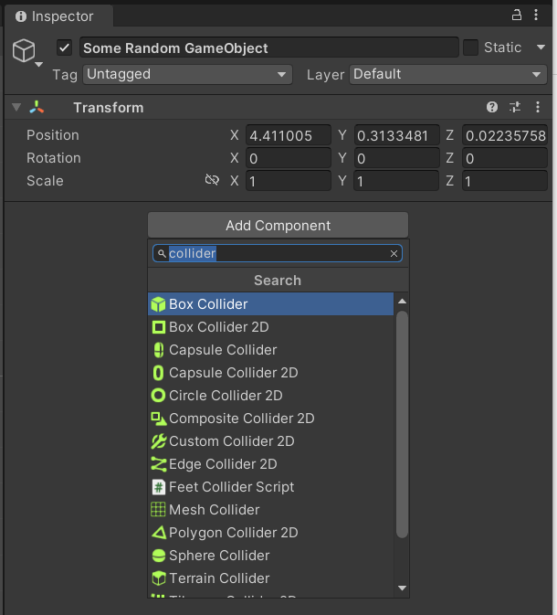

To add a collider to a GameObject:
1. Select the object in the hierarchy and then in the Inspector
2. Click the Add Component button
3. In the search bar, type “Collider”, and select the shape that you want to use

For this lab, we will be using the **Box Collider 2D** and the **Circle Collider 2D** components to implement parts of a naive jump function and an enemy turret that shoots projectiles at the player.

## Colliders & Triggers
If you already have a solid understanding of how colliders work, the OnCollisionEnter/Stay/Exit() functions, and the OnTriggerEnter/Stay/Exit() functions, then feel free to skip this section.

  
Imagine these are two GameObjects moving towards each other.

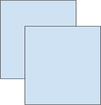  
If neither of them have colliders, then there will be no physical collision when they bump into each other, which may not necessarily be the behavior we want. Instead, they will continue through each other.

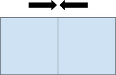  
However, with colliders (NOT triggers) attached, these two squares will stop when they come into contact.

There are three methods that will execute whenever a collision occurs:
- On the frame that they come into contact, the `OnCollisionEnter()` function is called. 
- For every frame that they remain in contact, `OnCollisionStay()` is called.
- On the frame that they leave contact, `OnCollisionExit()` is called.

To define what happens when two colliders interact, you must implement these three functions in the scripts that you assign to the GameObjects with colliders. It is not necessary to implement all three; for example, if you are only concerned with what happens when collision begins, then feel free to only implement OnCollisionEnter.

**Triggers** are colliders that do not cause physical collisions, obtained by selecting the “Is Trigger” option in the collider component. Their main use case is when you want a collision to trigger something without any physical interactions or barriers.  

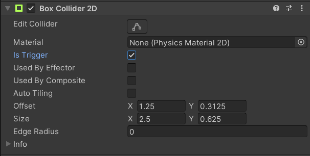  

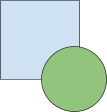  
If you have a trigger collider (Green), it will not physically collide with any other colliders (Blue).

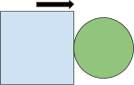  
Instead, the trigger functions will be called in the same way as the collision functions without a physical collision. OnTriggerEnter() is called on the frame when the trigger comes into contact with another collider.

  
OnTriggerStay() is called for every frame that the trigger and another collider remain in contact.

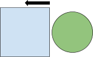  
OnTriggerExit() is called on the frame when the trigger and another collider leave contact.

It’s important to note that these collider functions will only be called if at least one of the GameObjects involved in the collision has a Rigidbody component attached.  
**No Rigidbody = No collision!**

## Physics Layers
Every object in Unity is assigned to a layer:  

  

By default, everything is on the Default layer and Game Objects from all layers can collide with one another. However, when your game starts having multiple types of objects, collision interactions can start becoming increasingly complicated.

For example, let’s say that you want a special bullet object that is able to pass through the ground but still able to hit enemies.  
Instead of modifying the collision functions of the bullet and ground objects, you can instead utilize Unity’s layer collision matrix, which allows you to toggle collisions between specific layers:

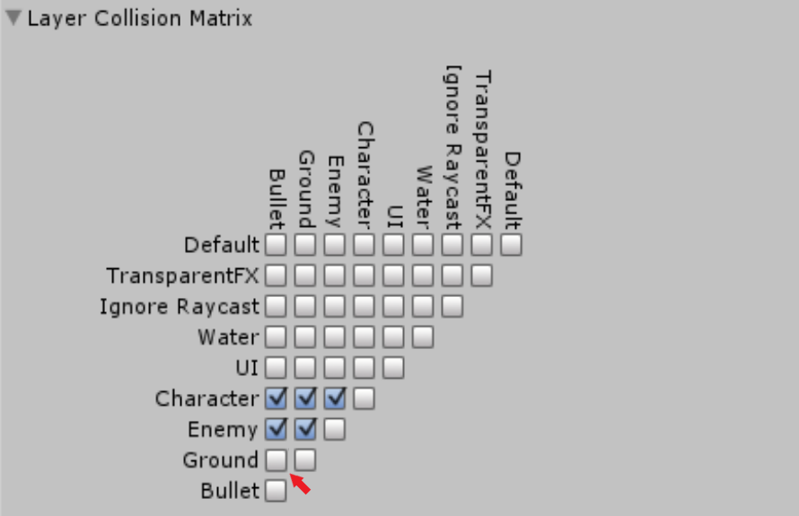  
By unchecking the Bullet X Ground box, Game Objects on the Bullet and Ground layers will no longer collide with each other (physical and trigger). To access the collision matrix, go to Edit > Project Settings > Physics2D (for 2D games). This is a very useful tool in specifying your collider interactions!

### Task 1

Open up the JumpDemo scene if you haven’t already. 
<!--For this task, you will need to enable the following: -->

<!-- - PlayerTask1, MainCamera, and Environment
- Disable all the others by clicking on them in the hierarchy and unchecking the box to the left of its name in the inspector -->

1. Hit the play button. The player should fall right through the floor. This doesn’t seem like something we want, so let’s fix it. Add a **Box Collider 2D** component to PlayerTask1 and size it appropriately by modifying the variables in the inspector OR clicking “Edit Collider” and adjusting the collider in the scene view.

2. Hit the play button again. Now, the player should be able to physically collide with all of the platforms and walls. Try moving around and jumping (Space). Right now you can jump … anytime you want. Let’s fix that.

3. We will now fix some problems with jumping. In the Scripts/Collider folder, open PlayerControllerTask1.cs. This is the script that controls the PlayerTask1 object. Modify the sections labeled ‘Task 1’ so that you **should only be able to jump if you are touching a platform, wall, or floor.**

### Task 2

For this task, you will need to enable the following:
- PlayerTask2, MainCamera, and Environment
- Disable all others

1. We will now implement a smarter check for jumping. Notice that PlayerTask2 itself does not have a box collider -- you can accomplish this task without a collider directly on the GameObject. Make modifications so that PlayerTask2 **can jump only when its *feet* are touching the ground.**

You should only be modifying the **FeetCollider** script and **PlayerController2** script. If you need hints, take a look at the children of PlayerTask2 and the other scripts.

### Task 3

For this task, you will need to enable the following:
- PlayerTask2, ShooterBoss, MainCamera, and Environment
- Disable all others

1. We will now implement a **ShooterBoss** that behaves like a turret. The ShooterBoss keeps a list of all targets within a radius (of your choosing). Upon entering the radius, the player should be added to that list. Upon exiting the radius, the player should be removed from that list. The shooting function is already completed, so you just need to worry about adding and removing targets from the list. *HINT: This task will require use of a trigger collider.*

## Lab Checkpoint

You should now have an understanding of what Colliders are, the differences between colliders and triggers, and how to use them. They are simple but incredibly powerful building blocks that are used in practically every game, and will be invaluable as you build your own games! This ends the collider’s portion of the lab. You should be able to show the following.

1. Show functionality of PlayerTask1, and that it can jump when touching any physical barrier.
2. Show functionality of PlayerTask2, and that it can jump only when its feet are touching the ground.
3. Show that the ShooterBoss only fires projectiles while you are within its radius.

## Rigidbodies

You will explore different properties of the Rigidbody2D component, and how changes made to them will affect the behavior of the GameObject that they are attached to.  You will also be introduced to a few different types of movement control, as well as different methods of capturing user input from a keyboard or a controller.

You will complete a series of exercises designed around different properties of the Rigidbody2D component; each one can be completed by varying the property in question in order to achieve a desired behavior for the GameObject.  You will also explore movement control by using different movement methods to navigate a ball through a maze.

Upon completion of this lab, you should understand how to use the Rigidbody2D properties covered in the exercises.  You should also be able to explain, in your own words, the differences between different types of movement control.  You should be familiar with a few different ways to process user input and how changing the values of different fields in the Input Manager can affect gameplay.

### Task 4

1. Verify that the GravityChamber Scene is currently open (your screen should match Figure 1).  If it is not, Navigate to File > Open Scene > Scenes > GravityChamber.

    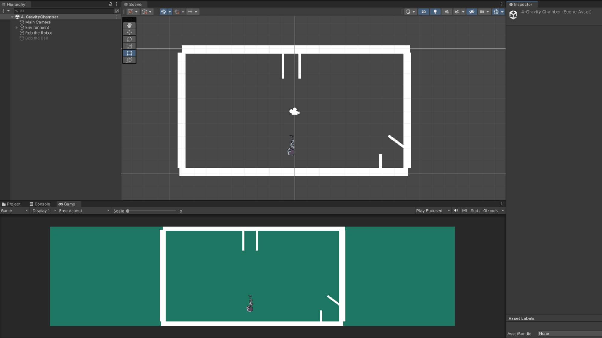  

2. Deactivate the GameObject labeled **Bob the Ball** by clicking the box next to the object’s name in the *Inspector*.  If it is already deactivated, proceed to step 3.
3. Select the GameObject **Rob the Robot** in the *Hierarchy*.
    1. In the Inspector, select Add Component and add a Rigidbody2D component to the object.

        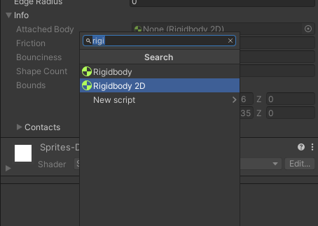

    2. Set the **Gravity Scale** field to a value of 5 and press Play.  Repeat this process with values of -1 and -2.5 and notice how these changes affect the movement of the Player.

        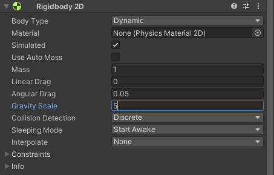

4. Activate **Bob the Ball** by clicking the same box that we selected to deactivate it earlier.
5. Adjust the Gravity Scales for both the ball and the robot so that the ball ends up in the bottom right corner of the box and the robot ends up in the goal zone on the ceiling.
6. **Save this Scene before moving onto the next task.**

### Task 5

1. Navigate to the **DragRoom** Scene.
    1. **Drag** is a force that acts opposite to the motion of a moving object, slowing it down over time.  
    2. The **Mass** of an object determines how forces will interact with it.  For instance, an object with more mass will require more force to move it.  
2. In this Scene, the script moving the ball adds a singular, horizontal push to the ball with a constant force.  Consequently, increasing or decreasing the ball’s Mass will affect its initial speed in different ways.  Adjust the values for Mass and Linear Drag to get the ball into the goal area in the bottom right corner.
    1. Note that while it is possible to achieve this task by only editing one of these fields, we encourage you to explore different values in order to gain a better idea of how different changes affect the object’s movement.
3. **Save this Scene before moving onto the next task.**

### Task 6

1. Navigate to the Scene labeled **Maze** and verify that your screen matches the image below. The ultimate goal for each of the tasks in this section will be to move the white ball through the maze until you reach the red square.

    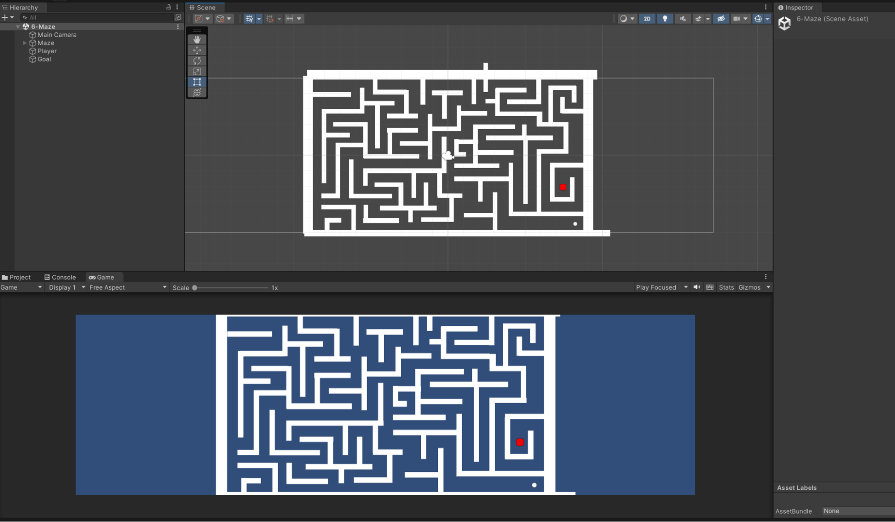  

2. Open the **CircleMovement** Script from the Scripts/RigidBody folder. Examine the block of code that matches the one transcribed below:

        // Update is called once per frame
        void Update () {
            xAxis = Input.GetAxisRaw(“Horizontal”);
            yAxis = Input.GetAxisRaw(“Vertical”);
            moveFunction1()
        }

        void moveFunction1() {
            Vector2 movementVector = new Vector2(xAxis, yAxis);
            playerRigidbody.AddForce(movementVector);
        }

This is the first of three different movement control functions that you will be exploring during this section.

Before we delve into the details of moveFunction1(), we will briefly examine how Unity processes user input from the keyboard.  Note the line of code in the Update() function that reads:

        xAxis = Input.GetAxisRaw(“Horizontal”);

1. Return to the Scene and navigate to **Edit > Project Settings**.  Select **Input**, then click the triangle next to **Horizontal**.  Verify that the window matches what you see below:

    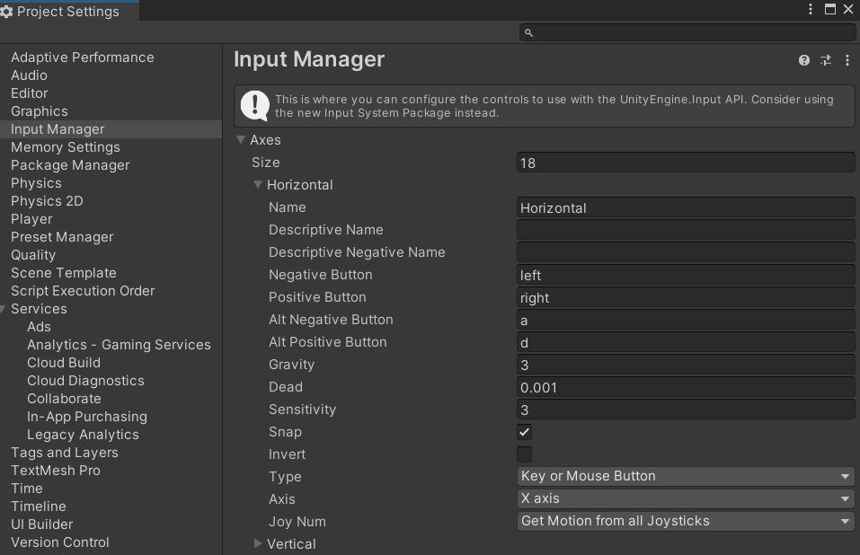  

2. Here is a brief explanation of the Input fields that will be important for this task:
    1. **Name** — This field is the string that will be used to access this axis.  For example, “Horizontal” in GetAxisRaw(“Horizontal”).
    2. **Negative and Alt Negative buttons** — These are the buttons that will return a value of -1 when pressed.  Under the current project settings, for example, Input.GetAxisRaw(“Horizontal”) = -1 if you were to press the left arrow key or the ‘a’ button.
    3. **Positive Button and Alt Positive buttons** — These are the buttons that will return a value of 1 when pressed.  Similar to the previous example, 

            Input.GetAxisRaw(“Horizontal”) = 1 if you were to press the right arrow key or the ‘d’ button.

    Return to the CircleMovement script and re-examine the code block for moveFunction1().  This function defines a 2D vector using our horizontal and vertical input axes.  The **AddForce()** function applies this vector as a force to the Rigidbody2D, resulting in movement.  

3. Try to run the maze using **moveFunction1()** as the function called  in **Update()** (you do not have to finish the maze in this step).  Notice what was easy and what was difficult using this type of movement and control.
4. Now examine the code block for **moveFunction2()**, transcribed below:

        void moveFunction2() {
            Vector2 movementVector = new Vector2(xAxis, yAxis);
            playerRigidbody.MovePosition(playerRigidbody.position + movementVector);
        }

    This function creates the same movement vector as the first.  However, rather than applying a force to the object, this function moves the actual RigidBody to the new coordinates specified by the movement vector; for example, if your Player is at (3, -3), pressing the left arrow key and up arrow key simultaneously will transform the object’s coordinates to (3-1, -3+1), resulting in a new position of (2,-2).

5. Change the function call in **Update()** to **movementFunction2()**.  Try to navigate the maze using this function.
    1. You may notice the ball clipping out of the map, skipping walls, and exhibiting other puzzling behavior.  This is due to the fact that the frame time in Unity does not always remain constant; the gameObject translation occurs one frame at a time, so changes in the frame time make the object appear as if it's moving at an irregular speed.  For example, a frame time of 10 milliseconds means the object will step forward one hundred times per second.  However, the frame time may increase to 25 milliseconds due to factors like CPU load, meaning that the object will only step forward forty times a second.   We can correct for this by scaling our movement with the frame time, allowing for a smoother and more controlled translation.  Add the following line to moveFunction2() before moving the Player Rigidbody:

            movementVector = movementVector * Time.deltaTime;

    The **Time.deltaTime** property reads out the frame time, therefore scaling the size of the movement step with changes in framerate.  

    Hint: If you're stuck, try printing out the value of Time.deltaTime and the movementVector to figure out what's happening!

6. Examine the code block for **moveFunction3()**, transcribed below:

        void moveFunction3() {
            Vector2 movementVector = new Vector2(xAxis, yAxis);
            playerRigidbody.velocity = movementVector;
        }

    This type of movement is called velocity control.  We define a Vector2 movement vector in the same way as with the previous functions, then set the velocity of our gameObject to our movement vector (recall that a vector has both a direction and magnitude).  If you try to run the maze, you may notice that moveFunction3() in its current state feels identical to moveFunction2(); however, moveFunction2() moves the actual rigidbody, while moveFunction3() instantaneously sets the velocity.

7. We can speed up the movement of our object by adding a multiplier to our movement vector. Try out a few values greater than 1 and select the one that you feel most comfortable with.  Note that this type of vector scaling can be done with all of your movement.

        void moveFunction3() {
            Vector2 movementVector = new Vector2(xAxis, yAxis);
            movementVector = movementVector * 4;
            playerRigidbody.velocity = movementVector;
        }

8. Run the maze with whichever function you feel the most comfortable with.
9. **Save this Scene before moving onto the next task.**

### Task 7

The body type of a Rigidbody2D determines which forces can and cannot be applied to it.  There are three types of bodies: **Dynamic**,  **Kinematic**, and **Static**.

- **Dynamic** — the body can be affected by both scripts and physics
- **Kinematic** — the body can only be affected by scripts, not by physics
- **Static** — the body cannot be moved

We have been using dynamic objects so far.  Briefly return to the different movement functions from the previous section and observe that moveFunction1() does not work if the circle is kinematic, since the script applies a physics force.  The other two movement functions should work correctly, however, because they directly modify the object.

- Dynamic objects are best for objects that are controlled by the player.
- Kinematic objects can be used for moving obstacles, platforms, or any other moving objects that the player can interact with but not  move (outside of script interactions).
- Static objects should be used for objects that are not meant to move (e.g. walls or floors).

1. Navigate to the **BodiesIntro** Scene.
2. Keep your circle as a dynamic object with the gravity set to 0.  Use whichever movement script you feel most comfortable with.  Use the player object to run into the robot, noticing if and when the robot responds to the collision across different body types.
3. While the body type is set to dynamic, the robot may begin to rotate when you collide with it at certain angles.  We can prevent this by adjusting the constraints of the Rigidbody2D, shown in the image below.  Freezing the rotation of the robot around the z axis means that the robot will no longer rotate when something collides with it.  Constraints have many useful applications for preventing characters from spinning and translating in undesirable ways.

    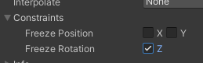 

## Checkoff Requirements

1. Show functionality of PlayerTask1, and that it can jump when touching any physical barrier.
2. Show functionality of PlayerTask2, and that it can jump only when its feet are touching the ground.
3. Show that the ShooterBoss only fires projectiles while you are within its radius. 
4. Demonstrate that you can land both the ball and the robot in the desired goal zones for the GravityChamber Scene.
5. Demonstrate that you can land the ball in the desired goal zone for the DragRoom Scene.
6. Demonstrate that you can complete the maze in the Movement Control section of this lab and briefly explain the different types of control covered in the section.

## Bug Reports
If you experience any bugs or typos within the lab itself, please report it [here!]

## Extra Credit
If you want more practice, try designing a Rube Goldberg machine in Unity like the one seen below!

You are required to have at least:
- 5 static bodies
- 5 dynamic bodies
- Negative/positive/zero gravity
- Some utilization of drag, mass, and rotation freezing

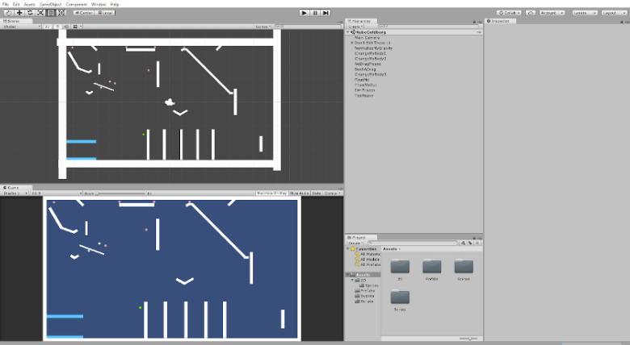 

[here!]: https://forms.gle/oGW8yyj6VVSsbhNE8 
[https://github.com/berkeleyGamedev/CollidersRigidbodyLab]: https://github.com/berkeleyGamedev/CollidersRigidbodyLab
