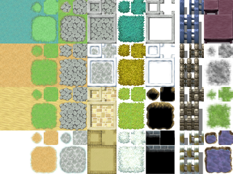
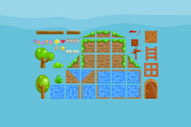
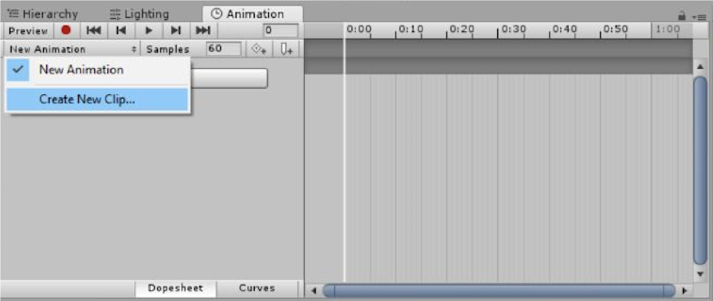
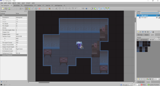
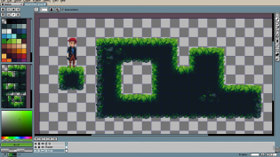

# Lab 7: Tilesets
{: .no_toc }

## Table of contents
{: .no_toc .text-delta }

1. TOC
{:toc}

[Download Lab 7](https://github.com/berkeleyGamedev/TilesetLab/archive/refs/heads/master.zip){: .btn .btn-blue }

## Overview

**Tilesets** are a collection of **tiles**, or square graphic images that are laid out in a grid to form the game environment. Many games, especially pixel games, are created through tilesets. It greatly speeds up the process of making game environments, because one set of 9 ground tiles can be used to quickly generate hundreds of unique floor plans. 

There is a separate lab called Tilemaps if you are interested in learning how to implement Tilesets. However, in this lab we will go into how to set up a drawing app to create Tilesets, and how to design them.

## What are Tilesets?

Like mentioned in the overview, Tilesets are a collection of tiles that can be smoothly aligned in a grid to make game environments. They can be made for many different game perspectives, like top-down (like in an RPG), sideview (Mario), or 2.5D isometric. Below are some examples of Tilesets. 

## Setting up Photoshop

Photoshop is a great asset in creating Tilesets (and it’s free for Berkeley students!). First, make a blank canvas. You can choose any small size you’d like; in this tutorial I’m going with 400x400. Once that’s open, go to `Edit > Preferences > Grids, Guides & Slices`. Under “grid”, change Gridline to every 32 pixels. That way, the grids will be 32x32. 

If the grid isn’t showing up, go to `View Menu > Pixel Aspect Ratio and go to View > Showing` and turn it on. Once you are all done, your Photoshop should look something like this:

## Tileset Apps

If you don’t have or want to work in Photoshop, the same setup can be used in any other app with a grid feature, or you can draw tiles individually with a bit more trouble. Additionally, apps such as Tiled (left) or Aseprite (right) have been created specifically for pixel art and tilesets, and can be incredibly helpful for artists who want to check in real time if their sprites connect. 
This lab does not in any way require download of these apps, but I recommend artists who are working on 2D pixel games to consider them!

## Designing Tilesets 

Tiles, when placed next to each other, should create a smooth background. To achieve this, you’ll 
need to create two 3x3 sets of tiles: one for the outer edge of grass and one for the inner edge. 
This goes for any environment tiles you’d like to create where two different textures meet, like a 
dirt road with grass at the edge, or bodies of water among grass. It should look something like the 
image to the left. 
You would also need to create a center grass tile in the “inner rounding” 3x3 set that isn’t 
featured here. One option is to simply just draw the tiles from a blank Photoshop canvas with the 
grids set up, but Brackeys made a great template to use: [Brackey's Photoshop Template].
s
Clicking that link should take you to a Tileset template that looks like this:

In the layers coded by colors are the files for the four tiles: side, corner, filler, and corner. 

Double-clicking on any of the four tiles will open the working Photoshop file in another tab. You can then select the tab with the template and drag it out so it’s visible while you still have the page for the tile open. That way, you can see any changes you make instantly on the Tileset Template page when you save the tile.

## Check-off

For this lab, your job is to create your own Tileset! You can make a Tileset for any environment you’d like, but it has to have two different surfaces making contact (ex. grass and cobblestone, dirt and water). Show a facilitator the 3x3 tiles for the outer and inner rounding.

## Bug Reports
If you experience any bugs or typos within the lab itself, please report it [here!]

[here!]: https://forms.gle/oiyM6iu3MinHfmNc7 
[Brackey's Photoshop Template]: https://goo.gl/Xih8nw
[https://github.com/berkeleyGamedev/TilesetLab]: https://github.com/berkeleyGamedev/TilesetLab
