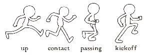
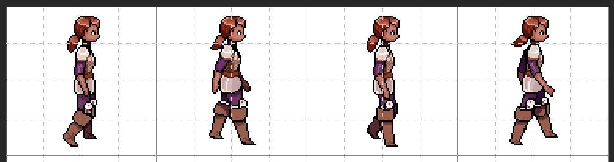
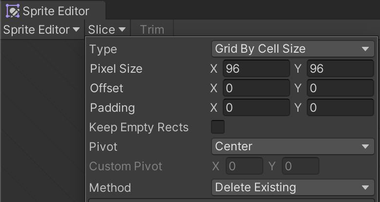
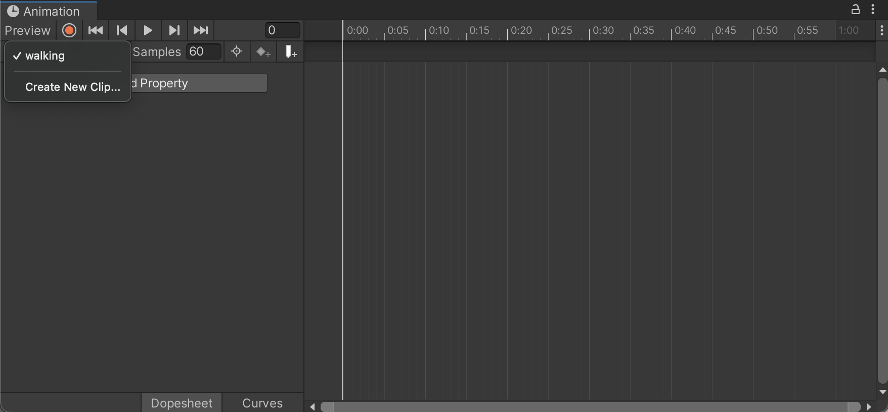
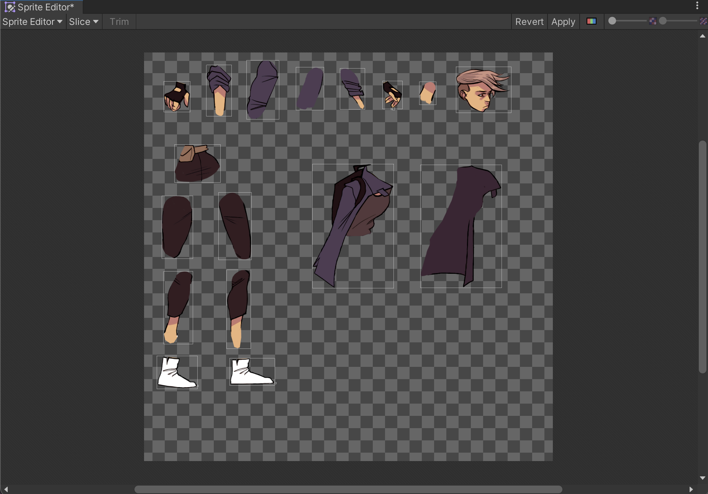
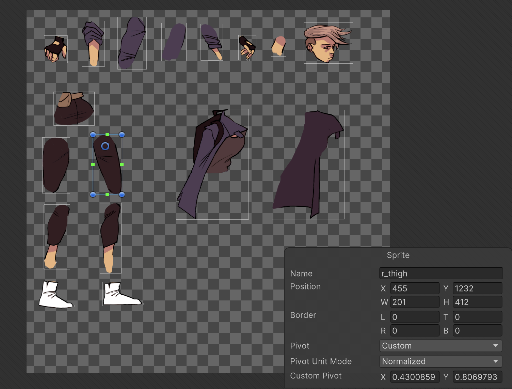
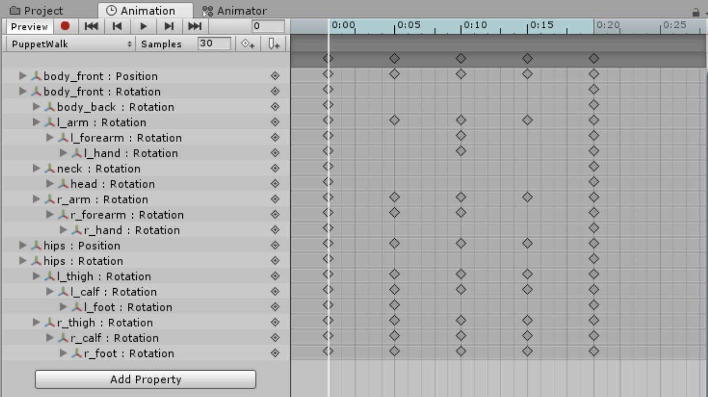

# Lab 7: Animation
{: .no_toc }

## Table of contents
{: .no_toc .text-delta }

1. TOC
{:toc}

**NOTE**: Download the lab, unzip it, and open the project folder in Unity Hub!

[Download Lab 7](https://github.com/berkeleyGamedev/AnimationLab/archive/refs/heads/master.zip){: .btn .btn-blue }

## Overview
In this lab, you will be getting a preview of the game animation pipeline, starting with a Photoshop sprite to a finished Unity animation! For this lab, we will be covering both sprite-based and puppet-based animation, as well as some techniques for creating sprite-based animations. However, we won’t go too in depth about how to animate it in Unity, as there is another lab (Animator and Blend Trees) that covers it in more detail--be sure to check that out!

The **Sprite-based** (or Cast-based) is a type of frame-based animation which involves each frame being drawn individually. Sprite-based animation involves objects that move independently of the background. This is a very popular form of animation and has seen a lot of usage in video games. Frame-by-frame animation generally takes more time per animation frame but gives you much more freedom in your sprites, allowing for more convincing animations.

|  | 
|:---:|
| Example of Sprite-Based animation | 

The **​Modular** ​or Puppet​ ​method has more overhead, and is harder to make look realistic, but it is very easily scalable if you have lots of animations. It’s not well-suited to low-resolution or pixel animations, although there are ways of making it work. ​[**Warning**: ​This method may take you longer than the sprite-based method, depending on the complexity of your model. It’s only recommended if you are comfortable with sprite-based animations.]

||
|:---:|
|Example of Modular-Based animation|

The lab checkoff will only require **one** animation, so pick whichever method works best for you! 

## Making Sprites
Open a canvas in your preferred drawing software. In this lab, we’ll be making a walk animation. We have provided sprites in the lab file for reference, but artists must draw their own sprites of an existing/original character.

We’ll be doing the **​passing** and **up**​ poses. This is just **​four​ ​frames**​ in total (two for each step for the left and right), although for your actual game animations you can (and should!) add frames in between to make the animation more fluid.

We’ll first go over the Sprite-based method. Even if you’re doing the modular-based method, it’s recommended to at least skim through the next part, so that you’re familiar!

## Sprite-based Method

### Making the Sprites 

Keep in mind the **​12 principles of animation**​ while you animate to make your animations bouncier, and more believable! Also, don’t be afraid to look up frames online by googling images of *insert action* animation frames (i.e. ​**walking animation frames​**) so that you can get an idea of how many frames you need and what each frame should roughly look like.

#### **Photoshop**

1. **Set up a grid**. For the walking animation, we’ll focus on drawing four keyframes (you can use the file labeled *sprites.png* as a reference to follow in the downloaded lab folder). Start with a blank canvas. If you want to do pixel art, a suggested canvas size would be 256 (width) x 64 (height) pixels or 512 x 128 pixels. Otherwise, you can have a resolution of your choosing, but make sure that the width is four times the height. After you have your canvas in Photoshop, go to `View > Show` and make sure `Grid` is checked. Then go to `Photoshop > Settings > Preferences > Guides, Grid & Slices` and change `Gridline Every…` to the height size. Now, you should have four squares of equal size where you can draw each keyframe!

2. Now, on a new layer, **draw one keyframe**. ​Use the grid to center the drawing inside the **leftmost grid square**​. With `​View > Snap` ​enabled, you can do this by selecting the **​Move tool** and holding **Shift** ​as you click and drag the layer vertically or horizontally. 

    

    We’ll be making adjustments to this frame for later frames to reduce the amount of work necessary.

3. **Draw the other three frames on separate layers**. ​You can do this by copy and pasting your first keyframe three times into adjacent grid squares, then changing parts that need to move. This can save you having to redraw parts like the head and face, which don’t change as much. 

#### **Procreate**
1. **Set up**. On a new canvas, go to `Actions(Wrench icon) > Canvas` here you can turn on Animation Assist (onion skinning) and Drawing guide (grid).

    
    1. Animation Assist has many features that allows users for better animation workflow. One of the features is onion skinning which is used to see previous frames simultaneously, allowing us to create smooth motions. 

    2. The Drawing Guide sets up the grid on your canvas. Feel free to customize the grid to suit your needs in `Edit Drawing Guide`

2. Now draw your walk-cycle either with Animation Assist or spaced out evenly with the grid (follow Photoshop method steps 2 and 3 as the pipeline is practically the same).  

3. **Exporting**. When you're happy with your walk-cycle, it's time to export by selecting `Actions (Wrench Icon) > Share > Share Image > PNG`. 

{: .note} 
> For a transparent background, deselect the background color before exporting as a PNG.

If you had done your walk-cycle using the Drawing Guide (Photoshop method) you're done and can move on to **Importing Sprites**. However, if you created your walk-cycle with onion skinning, you'll find that all your sprites are on top of each other and on different layers! To fix this: 
1. Export every layer by `Actions (Wrench Icon) > Share > Share Layers > PNG Files`. 

    {: .note}
    > You can directly import these sprites into Unity without making the sprite sheet. However, sprite sheets are generally more time-efficient and provide better organization. You can read more about this at [Why Should I Use A Sprite Sheet?](https://www.finalparsec.com/Blog/ViewPost/why-should-i-use-a-sprite-sheet)

2. Navigate to any sprite sheet maker and import all of your images. You will end up with a complete sprite sheet PNG of your walk-cycle animation! 
     - [Finalparsec]
     - [CodeShack] 
     - [TexturePacker]

### Importing Sprites
1. **Create a new 2D Unity project.**

2. **Create a Sprites Folder inside Assets**
    * You can do this by going to `Assets > Left Click > Create > Folder` and naming your new folder **Sprites**.

3. **Import**
    *  Inside the Sprites folder, right click the background and select `Import New Asset`.​ Locate and import your sprite sheet.

4. **Change Settings**
    * In the import settings window (right side tab) in the Inspector, find **Sprite Mode** ​and change to **Multiple**. If you are doing pixel art, change ​Filter Mode to​ Point​ (this will prevent your​ sprites from being blurry). Then, at the bottom, click ​`Apply`.

5. **Sprite Editor**
    * **Frame Based**:
        1. Click `Sprite Editor` in the **Inspector**. In the window that opens, click **​Slice**. ​Then, in ​**Type**, ​select **Grid By Cell​ Size**. Choose the height size that you used to make your canvas size/grid. Then, click `Slice`.
        

### Creating Animations
This part will go by very quickly. We will provide a more in-depth explanation and learn how to animate a sprite to walk in other directions well in a later lab (the Animator and Blend Trees lab).

1. Right click in the **Hierarchy**​ and click ​ `Create Empty`. ​ While the **Player** object is still selected in the **Hierarchy**, click `Window > Animation > Animation` to open the ​Animation ​window. ​Then, click Create. This will create a New Clip. Name this clip **walking.anim** and save (Notice that if you select the **Player** object in the **Hierarchy**, an **Animator** component is automatically added in the **Inspector**). For future reference, to create more animations, select the box that has your animation name (in this case, **walking.anim**) and click **Create New Clip**.

2. Frame Based
    1. In the **​Sprites** ​folder, click on the arrow next to your sprite sheet to expand it.
    

    2. Click and drag each sprite frame from the **​Sprites**​ folder to the **Animation**​ timeline, at ​**0:10 intervals. Add the last frame twice, 0:10 apart**​, to prevent a jitter as the animation loops. You should have a total of 5 frame markers. Click the play button in the **Animation**​ window to see the animation playing in the **Scene**. Feel free to adjust​ the **Samples value**​ ​and the frames’ spacing if the animation is too slow or fast.
    

**Congrats, you’re done!**

Next, we’ll cover the modular based animation.

## Modular-based Method

### Making the Sprites
Similar to the sprite based method, there’s a sprite provided for reference and any programmers attempting the lab, but artists *must* create their own sprites. 

1. **Draw your character**.​ You’ll be separating all their limbs into a big weird body-part sheet later, so pick a pose where the arms, legs, and head are all distinct and make a strong silhouette. Make sure the character is facing either right or left (¾ view can work as well). 

2. **Modularize**. Using the lasso tool (or something similar in the drawing program you use if you don’t use Photoshop) select each significant body part, cut them out of the character, and paste them somewhere on the canvas.​ ​At a **​minimum**​, you’ll need these parts:
    * Head + Torso (Can be one part) 
    * Right:
        * Arm
        * Thigh
        * Calf + Foot (Can be one part)
    * Left:
        * Arm
        * Thigh
        * Calf + Foot(Can be one part)

For some parts, you’ll need to go back and manually extend the lassoed drawing​ to allow for a smooth range of motion later on (see rounded-off limb ends below). Feel free to be as detailed as you want with the parts, but ​make sure to leave a lot of white space in between each one!

### Importing Sprites
1. **Create a new 2D Unity project.**

2. **Create a Sprites Folder inside Assets**
    * You can do this by going to `Assets > Create > Folder` and naming your new folder **Sprites**.

3. **Import**
    * Inside the folder, right click the background and select **Import New Asset**.​ Locate and import your sprite sheet.

4. **Change Settings**
    * In the import settings window in the Inspector, change ​**Sprite Mode** ​to **​Multiple**. If you are doing pixel art, change ​Filter Mode to​ Point​ (this will prevent your​ sprites from being blurry). Then click ​`Apply`.

### Sprite Editor
Click `Sprite Editor` in the **Inspector**. In the window that opens, click `​Slice`. ​Make sure the settings are **​Automatic, Center, and Delete Existing**, then click the ​`Slice`​ button at the bottom of the pop-out. This will automatically separate the sprite sheet into individual sprites.

Now, to edit the pivot points so that they resemble joints, click on each part and move the blue circle to its correct pivot location. For example, thighs pivot around the hips, calves pivot around the knee, and arms pivot around the shoulder. You can also set pivots values manually in the `Sprite Editor` ​window by entering values in the **​Custom Pivot** ​box. Make sure you save any changes made to any individual sprite by clicking the `Apply` button towards the top right side of the `Sprite Editor` window.

**Now is also a good time to​ ​name the body parts**. As you set pivots, rename each of the body​ parts with a R or L label and the part name. This will make organization much easier later on.

### Creating Animations
1. Right click in the **​Hierarchy** ​and select **​Create Empty**.​ Name this empty object **PlayerHolder**. ​Create another empty game object, name it **​Player**, ​and drag it​ ​onto **PlayerHolder** so that it becomes a child. This is so that translations and rotations we make to the character while animating it won’t affect its position in the world space. 

2. Expand your sprite sheet in the ​**Sprites** ​folder by clicking on the gray arrow.

3. Click and drag each body part onto the ​Scene ​view to its approximate location.

Then rearrange the objects in the **​Hierarchy** with parent-child relationships that roughly​ follow the organization of a skeleton. For example, `​Hips > Left Thigh > Left Calf > Left Foot`. ​This will make it much easier to animate later, since moving the hips would move everything attached to them at the same time.

4. The layer ordering will be messed up, so go to `​Edit > Project Settings > Tags & Layers` ​and create a new sorting layer called *​*Player** ​using the + button under **Sorting Layers**. Then, select all body parts and in the ​**Sprite Renderer** ​in the **Inspector**, ​ ​and​ ​change the sorting layer to **Player**. ​Now, change body parts’ **​Order in Layer** ​values to fix the ordering (like below) - objects with a higher **Order in Layer**​ value will be displayed above others. Take this time​ to also adjust the positioning of all body parts so that your character looks right. On the toolbar left of the **Play Button**, make sure that **Toggle Tool Handle Position** is set to **Pivot**. This will allow you to rotate your body parts according to your custom pivot points.

5. Click the **​Recording Mode (red circle)** button in the ​**Animation** ​window. This will save all your object rotations and translations as frames of animation. Move the white animation line marker to the **​0:05** ​mark. Then, use the rotation and translation tools to move each body part ​in the scene​ to make a walking keyframe. Go to the **​0:10** mark and move everything to the next keyframe. **Once you have made four​ keyframes, copy the first keyframe and paste it 0:05 after your last keyframe.** ​(You can do this by clicking on the top gray diamond of the last keyframe so that all the diamonds turn blue, doing Ctrl+C, then moving the white animation line marker to the right time and doing Ctrl+V).

6. When you’re done, click the **​Recording Mode** ​button again to exit recording mode. Notice that if you scrub through the top blue animation timeline, Unity interpolates your keyframes to create a smooth animation! At this point, your Animation window should look something like this:

7. Click the play button in the **​Animation** ​window to see the animation. Feel free to adjust the ​**Samples value** ​and the frames’ spacing if the animation is too slow or fast.

**Congrats, you’re done!**

## Supplementary Lecture
This [supplementary lecture](https://youtu.be/aBRQT8tvpKs?si=e6QbtktfhyV3X1hY) demonstrates how to improve your animations in the Animator using the 12 principles of animation.

## Checkoff Requirement
Show your animation window and play your finished animation, which should be made with entirely original sprites.
 
## Challenge
1. Try the other type of animation, if you didn’t do one of the types. 

2. Add in-between frames for a smoother, more dynamic animation!

## Bug Reports
If you experience any bugs or typos within the lab itself, please report it [here!]

[https://github.com/berkeleyGamedev/AnimationLab]: https://github.com/berkeleyGamedev/AnimationLab
[here!]: https://forms.gle/oiyM6iu3MinHfmNc7 
[https://youtu.be/aBRQT8tvpKs]: https://youtu.be/aBRQT8tvpKs

[Finalparsec]: https://www.finalparsec.com/tools/sprite_sheet_maker 
[Codeshack]: https://codeshack.io/images-sprite-sheet-generator/
[TexturePacker]: https://www.codeandweb.com/texturepacker
