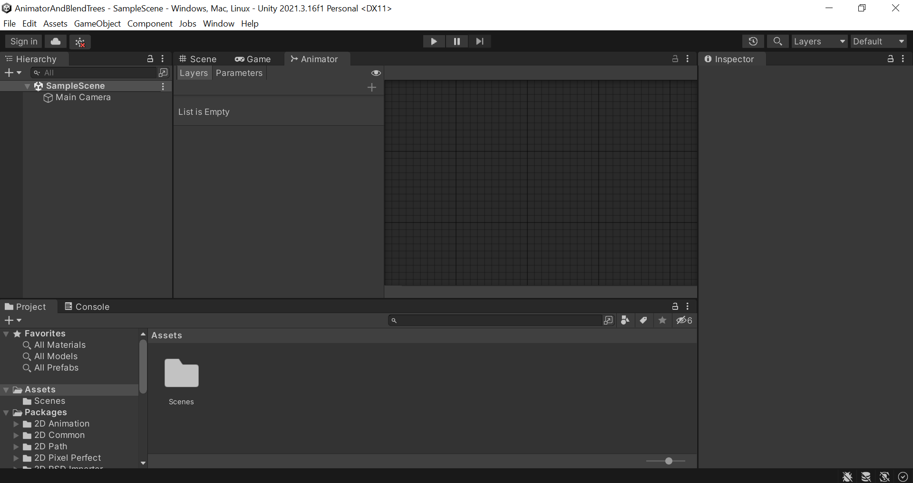
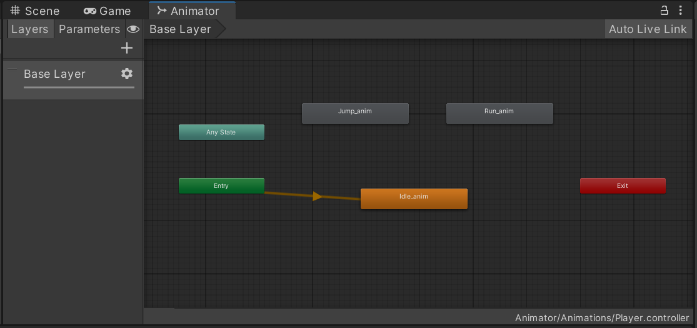
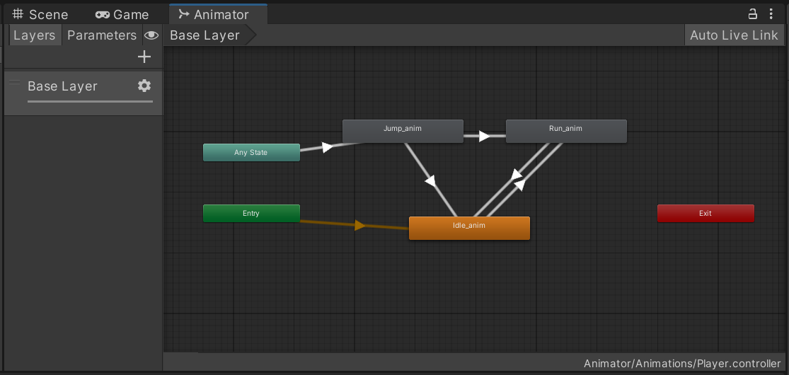
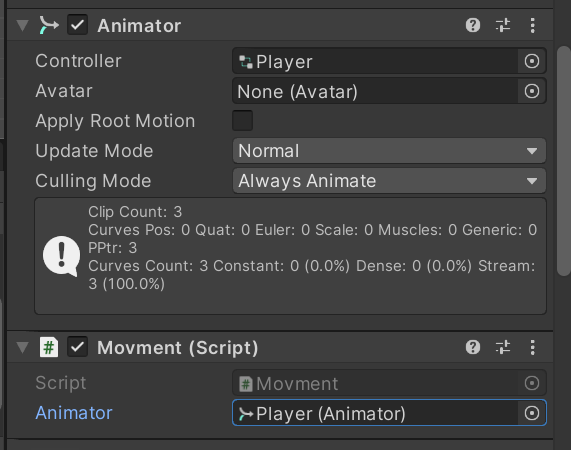
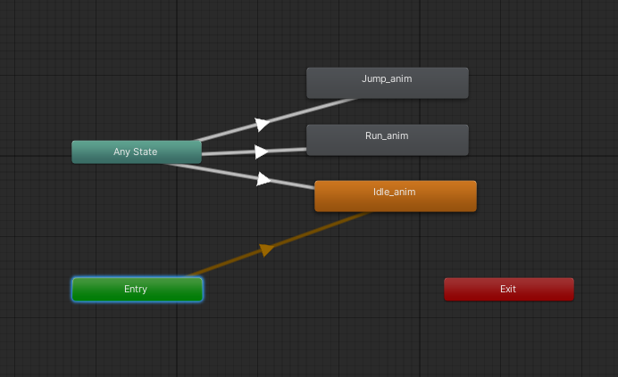
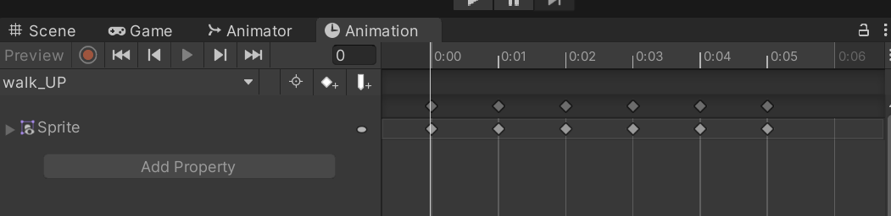
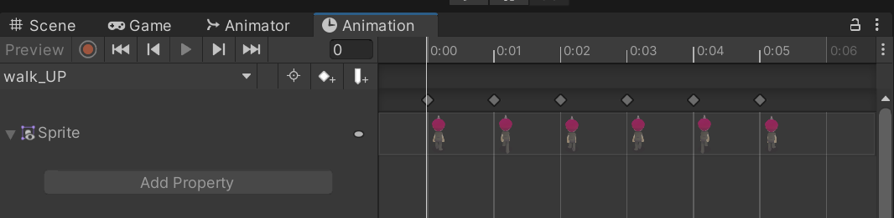
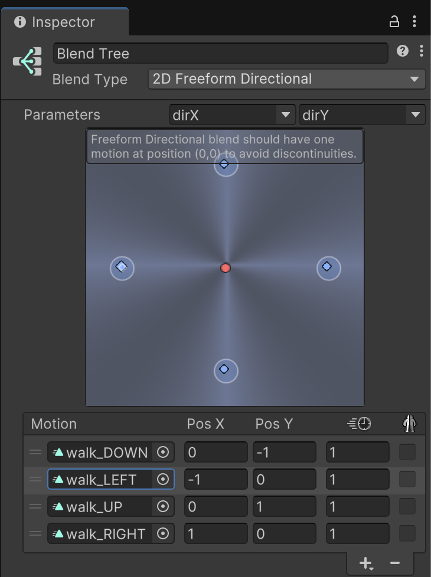
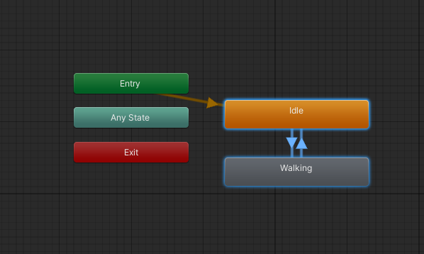
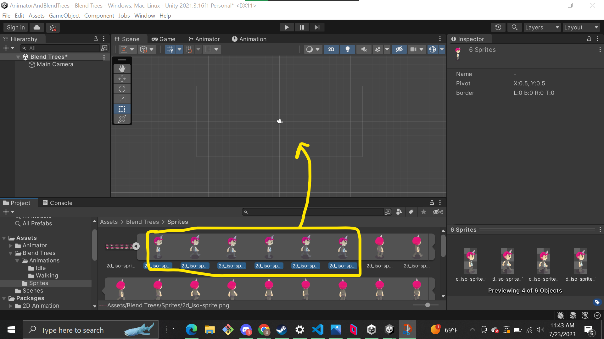

# Lab 8: Animator and Blend Trees
{: .no_toc }

## Table of contents
{: .no_toc .text-delta }

1. TOC
{:toc}

[Download Lab 8](https://github.com/berkeleyGamedev/AnimatorAndBlendTreesLab/archive/refs/heads/master.zip){: .btn .btn-blue }

## Overview

The **Animator** is an element with an associated Component and Window (similar to Inspector, Project, Animation, etc.) 

This window is where you connect your code to the visuals by defining the animation transitions. 

**Blend Trees** are used inside of the Animator to organize and smooth the transition between similar Animations. 
Use cases of blend trees include transitioning between walk and run animations depending on how far you’re pushing your joystick or simply transitioning between up/down/left/right movement animations in a top-down 2D game (think retro Legend of Zelda). 

In this lab, we will go through the process of implementing an Animator component for a player GameObject using predefined animations (either through the provided frames or through your own .anim files). Then we will communicate between the code handling the player movement and the animation transitions to finish implementing a simple 2D platformer player with idle, run and jump animation states. 
After that, we will implement a blend tree to transition between four different animation states for a top-down 2D game. 
**By the end of this lab, you should be comfortable with creating and customizing Animator mappings, as well as recognizing how to simplify mappings using blend trees to support whatever your future games will require.**

## Setup

Open the `Animator` scene under `Assets > Scenes > Animator`. Once upon, you'll want to also pull up the Animator window. Go to the `Window` tab in the top bar and navigate to `Animation > Animator`. Once it’s open, double click on the `Animator scene`, or make sure the `Animator scene` is open, load in the pre-setup. You have two options to set up the rest of this lab in your `Animator`: load your animation frames or load your .anim files if you have pre-made animations.

### Load Your Animation Frames

1. For each folder within `Animator/Animations/Frames`, select all the images, click and drag them over the Player GameObject in the `Hierarchy View`. 
2. This will create animations using each set of images you selected. Name them Idle_Anim, Jump_Anim and Run_Anim respectively and create them inside the `Assets/Animator/Animations` folder. 
3. Be sure to preview the animations to make sure they’re playing at the right speed, review the Animation lab for details on how to use the `Animation View`. 
4. Notice that inside the `Animations` folder in the `Project View`, there is a new item called “Player.” 
5. Select this item to reveal that it is a Component of type Animator. 
6. Select the Player GameObject in the `Hierarchy`, note that this Component has automatically been added as a result of your dragging and dropping. 
7. Double-click the Player Animator in the `Project View` to open the `Animator View`. Alternatively, you can open the Animator by navigating to `Window>Animation>Animator`.

### Load Your .anim Files into States

1. If you have your own .anim files you want to use for this tutorial, add the Animator component to the Player GameObject by selecting “Add Component” and typing in “Animator” and title it “Player.” Save it to the `Assets/Animator/Animations` folder.
2. Double-click the Player Animator in the `Project View` to open the `Animator View`. Alternatively, you can open the Animator by navigating to `Window>Animation>Animator`.
3. Right click the empty space and select “New State.”
4. Select this new state so that its properties appear in the `Inspector`.
5. Drag your .anim file from the `Project` into the `Inspector` over the Motion field to load your animation.
6. Rename your new state(s) accordingly.

## The Animator

Your Animator should look something like this, with an Entry state, an Any State, three _anim states, and one Exit state.

### Transitions

Upon Entry, we will go directly to the Idle animation. Think for a moment about how you would want to be able to transition from one state to another, sketch out or visualize what that would look like in this mapping, then continue reading. 4 From Idle, we want to be able to transition into Run, and from either Idle or Run we want to be able to transition into a Jump. After we finish Jumping, we want to be able to stand Idle or continue Running, and of course we also want to be able to stop Running and stay Idle. To create a transition, right-click a state and select “Make Transition” and left-click the destination state. 
Create transitions according to the following Animator mapping:

How will we determine when to execute a transition? We need to define parameters that will only activate when our specified conditions are met.

**At a high level:**
- We will be idle if we are not moving 
- We will run when the magnitude of our velocity (our speed) is anything other than 0
- We know we will jump when the jump button is pushed. 

On the left half of the `Animator View`, observe the `Parameters` tab. Use the + button to the right of the search field to create a new float parameter called “Speed” and a new Trigger parameter called “Jump.” Note that the capitalization of these variable names do matter, so try to stay consistent in your naming conventions. 
Now we will implement these parameters into the State Transitions we defined above. 

Select the transition arrow from Idle to Run. In the `Inspector`, click the + button under the Conditions tab and define it to react only when Speed is greater than 0.5. We just need a small number; technically, a number like 0.00001 would suffice, but 0.5 just looks cleaner and functions the same for the purposes of this tutorial so we’ll stick with that.

Now make the following changes:
- Select the transition from Run to Idle and set it to activate only when Speed is less than 0.5 
- Select the transition from Jump to Idle and set it to activate only when Speed is less than 0.5 
- Select the transition from Any State to Jump and set it to activate only when the Jump Trigger is activated.

You may be wondering why we can’t use the Any State to transition to Idle and Run the same way we did for Jump. It’s not that you can’t, there are many ways to implement an Animator, this is just one of them. You could use a Boolean to check isMoving, instead of having a Speed float variable, or have an isJumping Boolean to check for whether a foot collider is touching the ground or not. Be sure to explore, expand or redesign this implementation as part of the extra challenges part of this lab

### Connecting to Scripts

Our Animator logic is all set up, everything makes sense in theory but none of it has truly been implemented yet. To do this, we’ll have to communicate our movement to the Animator Component through our movement script. 
Create a Movement.cs script and attach it to the Player GameObject. 
In order to communicate with the Animator, we’ll need to create a reference to it in our script. 

You can either (1) create a private reference and use GetComponent to retrieve the Animator or (2) create a public reference and drag/drop the Animator in from the `Inspector View`.

1. 
        private Animator animator;
        ...
        void start() {
            animator = GetComponent<Animator>();
        ...

2. 
        public Animator animator;

Inside the script, create the Update() function. Inside Update(), check for inputs corresponding to whichever keys you’ve assigned to be left, right and jump using either Input.GetKey() or Input.GetButton. For jump, use GetKeyDown or GetButtonDown, as this will only trigger once when you push it, and will not continue to fire if you hold it. 

Using our reference to the animator, you can use the various .SetFloat/.SetBoolean/.SetTrigger methods to change the parameters inside the Animator. In our case, you’ll make the following calls at least one time: 
- animator.SetFloat(“Speed”, 1); 
- animator.SetFloat(“Speed”, 0); 
- animator.SetTrigger(“Jump”); 

Remember that because of the way we implemented our Speed check, you’ll have to manually reset the speed to 0 whenever you do not detect a left/right input. **Try implementing the script yourself before moving on to the staff solution.**

### Movement.cs

Since this isn’t really a scripting lab, the code for this script is below. Feel free to ctrl+c/ctrl+v the whole thing, but you will be required to understand how to modify the Animator parameters via code in order to check off:

        using System.Collections;
        using System.Collections.Generic;
        using UnityEngine;

        public class Movement : MonoBehaviour
        {

            private Animator animator;
            private Rigidbody2D rb;
            private SpriteRenderer sr;

            // Start is called before the first frame update
            void Start()
            {
                animator = GetComponent<Animator>();
                sr = GetComponent<SpriteRenderer>();
                rb = GetComponent<Rigidbody2D>();
                
            }

            // Update is called once per frame
            void Update()
            {
                if (Input.GetKeyDown(KeyCode.UpArrow))
                {
                    animator.SetTrigger("Jump");
                    rb.AddForce(new Vector2(0, 5), ForceMode2D.Impulse);
                }
                if (Input.GetKey(KeyCode.RightArrow))
                {
                    animator.SetFloat("Speed", 1);
                    transform.position = (Vector2)transform.position + new Vector2(-5, 0) * Time.deltaTime;
                    sr.flipX = true;
                }
                else if (Input.GetKey(KeyCode.LeftArrow))
                {
                    animator.SetFloat("Speed", 1);
                    transform.position = (Vector2)transform.position + new Vector2(5, 0) * Time.deltaTime;
                    sr.flipX = false;
                } else
                {
                    animator.SetFloat("Speed", 0);
                }
            }
        }

### Testing

Ensure that the `Game View` and `Animator View` are open side-by-side and not in the same Window. This will let you view the animator at work during live play and modify the parameters directly.
Hit the play button and notice that even though we didn’t assign a Sprite to the Player, the animation provides it all the same. 
Also note that you can view the current animation playing inside of the Animator denoted by the little progress bar in the active state looping. 

Test our Jump logic by clicking the little bubble next to Jump in the Parameters list. If all goes as planned, you should play through most of your Jump animation. The trigger acts as a one-time button rather than a Boolean switch; it flips on for a single frame and then automatically switches off.

Change your speed variable to be greater than 0.5 then change it back to 0 to view the transition. This is useful for testing your logic.
One issue here is that the Jump animation looks like it’s been cut short. This is due to the transition time from 
one animation to another. 

Exit playmode and select the transition leading into Jump. Disable “Has Exit Time” and set Transition Duration to 0. This will make the transition from Idle/Run to Jump instantaneous with no smoothing. For player actions that require quick visual feedback like jumping, attacking or dashing, you should consider reducing or removing exit and transition time. 
For things like idle into running, you may want to leave the transition to make it feel smoother. This is all up to your preference.

### Tweaking Animation Speeds

Press the Play button and try jumping. Notice how the jump animation is too quick; we can fix this by selecting the jump animation state and slowing the speed down. Tweak it around to see what feels right for you and feel free to change the jump strength in the script. I found a speed of 0.25 to work well with this implementation. Don’t be afraid of going into the `Animation View` and modifying the length of the animation itself instead of just changing the overall playback speed! 

### Animator Checkoff

Change the Speed parameter from a float to a Boolean and make the appropriate changes in the script to ensure the same functionality. Explain the process of implementing transitions in the Animator and setting parameters in code.

### Animator Challenge

Remove the ability to infinite jump while in the air (i.e. you can only jump if you’re on the ground) Make whatever changes necessary to make this Animator map function the same way as our current implementation: 

## Blend Trees

The animation frames are already set up for the player’s four directions (up, down, left, right). In this lab, we will set up and test a Blend Tree. 
If you want to learn how to set up these animations, please visit the [appendix](#appendix).

1. Inside the `Blend Trees` folder, open the Animation Controller called “player_Animation”
2. In the `Animator` window, we can see that for now, the player is only connected up to an idle animation
3. We want to set it up so that a different walk animation plays when the player changes direction so that the player faces the direction it’s moving in.
4. To check our animations are set up, you can find them in the `Blend Trees/Animation/Walking` folder. If you open them, they should have a couple keyframes that show up in the `Animation` window. If you click on Sprite, the frames should show up.

    
    

5. Go back to the player_Animation object and in the `Animator View`, right click the background, then click **`Create State > From New Blend Tree`** to create a new blend tree node. Name this blend tree “Walking”. Right click the node and click **Set as Layer Default State.**
6. Double click the blend tree you just created to open it and click on the node that appears. In the Inspector, select **“Freeform Directional”** from the drop-down menu and make sure the parameters that appear are **“dirX”** and **“dirY”**. These have been configured in the player movement script to correspond to the relative direction of the player’s mouse from the character’s location. The blend tree will check these values to decide which walking animation to play. Now click the plus button and select **Add Motion Field**.
7. Click the circle next to **None (Motion)** and select “walk_DOWN” from the list that appears. Update the “Pos X” field with 0, and the “Pos Y” field with -1. This is because the coordinates correspond to (0, -1). The third field is the animation speed; leave it as it is. 
8. Add three more fields for each of the rest of the walking animations. walk_RIGHT corresponds to (1, 0), walk_UP corresponds to (0, 1), and so on. In the end, your blend tree should look something like this (note: the animation names are different in the picture than in your lab).
    
    

9. Finally, all that’s left to do is to create transitions between the idle and walking animations. Return to the Base Layer and right click on the Walking blend tree node, then select Make Transition. A white arrow will appear; click on the Idle blend tree node to anchor it. 
10. Click on the white arrow that appears between Walking and Idle. Press the plus button under “Conditions” and select “walking” from the drop-down menu, with a value of false. If “walking” does not show up, create the parameter as a Bool in the Animator sidebar. Uncheck the “Has Exit Time” box as well as the “Fixed Duration” box.
11. Create a second transition, this time from Idle to Walking, and set “walking” to true. 
12. Right click the Idle blend tree to make it the new Layer Default State. When you’re done, it should look like this:

    

13. Press play and move the character around by **right** clicking on the screen. Notice how now, a different animation is played when the player moves in a different direction! 

### Blend Trees Checkoff

Move your character around the screen in windowed play mode to show the blend tree changing.

### Blend Trees Challenge

If you find the sprite file in Assets/Blend Trees/Sprites, you’ll see the sprite has more animation frames than we’re using in the lab above: Up-Left, Up-Right, Down-Left, Down-Right. Set up the Walking Blend Tree to use the other four directions! Note: You’ll have to create the Animations with those sprite frames first.

## Appendix

### Setting up Animations for Blend Trees

1. Go to `Assets/Blend Trees/Sprites` to find the sprite image file. It should have multiple sprite images in one file.
2. Click the little triangle to the right of the file
3. Select the images you want as frames in your animation
4. Drag and drop them into your `Scene` window
5. This will pop up a window asking you to save this sequence as an animation.
6. Once you save, you should have a Unity animation object with the sequence of images!

The process might create new animation controllers for each animation sequence you drag drop into Scene. You can delete those without affecting the animation object.	

## Bug Reports
If you experience any bugs or typos within the lab itself, please report it [here!]

[here!]: https://forms.gle/1C2GPHGDHCQo3WWe7 