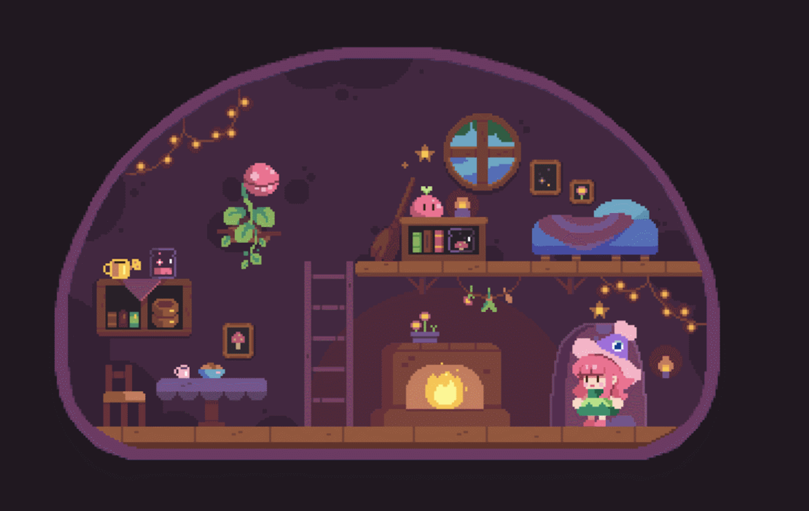
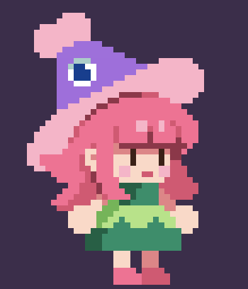
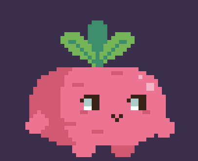
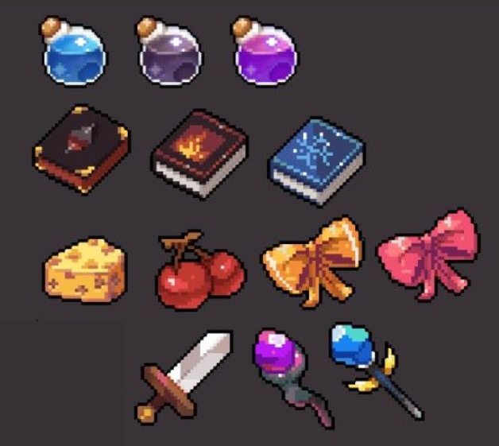
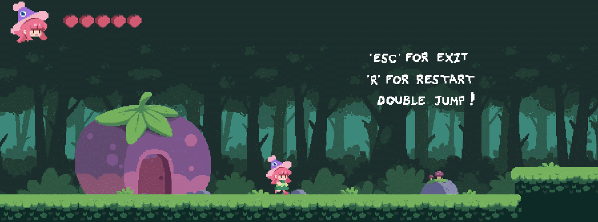
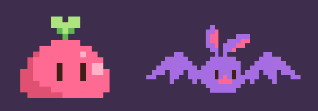
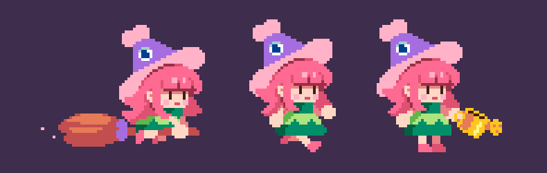
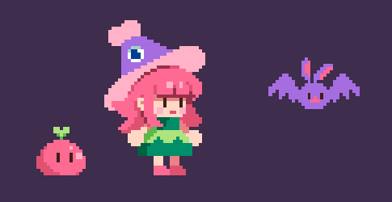

# Project 1: Artists
{: .no_toc }

## Table of contents
{: .no_toc .text-delta }

1. TOC
{:toc}

*The following illustrations are made by [Karina Dehtyar](https://www.behance.net/pixeldehtyar).*

## Overview
The objective of this project is to allow you to gain experience creating your own art assets and animations. Familiarizing yourself with the game art pipeline will hopefully help with managing time and efficiency with Projects 2 and 3. You will be creating everything from concept art to animations for an *original* game idea. The project will be split up into **two different parts** over a span of two weeks.

{: .note} 
> The original game idea you come up with in this project **cannot** be reused for Project 3! We want to encourage new ideas throughout the semester, so recycling your Project 1 is not allowed. 

For ease of reference, here is the Project 1 timeline: 

|---|---|---|
|Sept 11| Project 1 Released |  |
|Sept 18| Part 1 Deadline| **Due before Class!** |
||Art Critiques|Artists will receive feedback with an *in class* **art critique**. Part 2 is intended to be built upon your Part 1 submission and the feedback you received, so please come prepared for the critique.|
| Sept 25 | Part 2 Deadline | Due at 11:59 PM |

## Part 1: Creating Assets
To facilitate creating assets, you must determine what your game will be about. Creating a *mood board* of inspirations and reference photos can help determine the genre, game feel, and theme of your game. Your mood board can consist of practically any media (i.e., color schemes, character designs, other games,…). 

 **Part 1 submission deliverables will require you to explain what game your assets are built for, as well as your design choices.** 

||
|:---:|
|Mood Board Example|

When you have a solid picture for what you want to create, it's time to start your first iteration of assets for the game. Here is a checklist for what is required in your submission. Please feel free to go beyond the requirements. 

1. Environment 
    * This is dependent on what type of game you're creating. Generally speaking, an environment is a space where your character exists. (i.e., battle fields, open world, dungeons,...)
    
    ||
    |:---:|
    |Environment Example|

2. Characters
    * 2 or 3 *significantly* different character designs 
    * One of your characters should be your main character 

    ||
    |:---:|
    |Main Character Example|
    ||
    |Character Example|

3. Items and assets
    * Choose at least 3 *significantly* different items that is **relevant** to your game. 
    * They can be weapons, projectiles, obstacles, collectibles, or anything else you think is essential. 

    ||
    |:---:|
    |Items Example|

4. Choose one of the following: 
    * UI/UX 
        * A rough mockup of what your game will look like from the player’s point of view and one of the assets (like a health bar or menu).
    * 2 Enemies 

    ||
    |:---:|
    |UI/UX Example|

    ||
    |:---:|
    |Enemies Example|

### Submission

Compile your game art assets to a google drive and make sure it is accessible to facilitators. 

[Part 1 Due Thursday, 9/15 @ 6:59 PM.](https://tinyurl.com/gddf25proj1part1){: .btn .btn-purple }

## Art Critique 
An art critique is a group discussion where students will be able to give and receive feedback on artwork. You will be expected to *present* and discuss your Part 1 submission to your artist peers and art facilitators. 

You will receive a copy of your feedback after class. Since nothing is perfect on the first pass, we expect to see some meaningful changes in Part 2. 

{: .highlight }
It is absolutely *imperative* that you show up for this critique. **Failure to do so may result in a NP grade for Project 1.** Please email the staff if any circumstances comes up that prevents you from attending. 

## Part 2: Revise Assets and Create Animations
This part of the project is meant to revise your art assets and **create animations** for at least one character. 

 **Part 2 submission deliverables will require you to talk about your animations and explain the changes you made from Part 1.** 

You can choose to make additional assets for game components that you opted out of in Part 1 (such as UI or enemies). This is optional, but it can make your game art more fleshed out!

### Animation Guidelines
1. You must create *at least* 3 different animations. 
    * E.g., idle, walking, running, jumping, attacking, blocking,....

    ||
    |:---:|
    |Animation Example|

2. Animations are not limited to one character.
    * You can split up your animations between your characters. 

    ||
    |:---:|
    |Animation Example|

3. **Do not implement to Unity!**
    * We are not expecting you to import these assets and animations into a new Unity project. 
    * Ensure your animations are in a Gif or video format. 

### Submission

Compile your game art assets and **animations** to a google drive and make sure it is accessible to facilitators. 

[Part 2 Due Thursday, 9/25 @ 11:59 PM.](https://tinyurl.com/gddf25proj1part2){: .btn .btn-purple }

## Resources

[Piskel App] -  A place to create animated sprites in pixel art

[Code and Web]- A sprite sheet maker

[Unity 3D tutorials]  -  A myriad of unity tutorials on a variety of topics

[Itch.io game assets]- Lots of free game assets you can use as references

[Map Editor] - Tiled - A program which lets you design levels, maps, etc by importing your own art

[Tiled2Unity] - Tiled2Unity - Used to import Tiled files to Unity assets

[Studio Mini Boss Blog] - Awesome pixel art tutorial master page, everything from character design to pretty rocks to animated loops.

[Piskel App]: https://www.piskelapp.com/ 
[Code and Web]: https://www.codeandweb.com/texturepacker
[Unity 3D Tutorials]: https://unity3d.com/learn/tutorials
[Itch.io game assets]: https://itch.io/game-assets/free
[Map Editor]: http://www.mapeditor.org
[Tiled2Unity]: http://www.seanba.com/tiled2unity
[Studio Mini Boss Blog]: http://blog.studiominiboss.com/pixelart