# Project 1: Artists
{: .no_toc }

## Table of contents
{: .no_toc .text-delta }

1. TOC
{:toc}

## Overview
This project is to help you gain practice creating your own art assets and animations.  For this project, you will create everything from concept art to animations for an original game idea. The project will be split up into two different parts due over a span of three weeks. There are some project examples and a list of resources at the bottom of this document for your reference.

## Part 1: Creating Assets
To facilitate creating assets, first create a mood board of inspirations and reference photos. These can include photos of the color scheme to inspirations for the environment to reference photos of assets you’re creating.  Then create a first iteration of assets for the game:  
1. Environment (The world your character lives in)
2. Characters
    * Main character (2 or 3 significantly different designs)
3. Items and assets (x3)
    * Choose the most important items for your game’s aesthetic and gameplay. They can be weapons, projectiles, obstacles, collectibles, or anything else you think is essential (ie: A sword you pick up halfway through the game, some trees that show your game’s art style, 
4. Choose one:
    * UI/UX (x1)
        * A rough mockup of what your game will look like from the player’s point of view and one of the assets (like a health bar or menu). How can you make the UI both informative and minimalist?
    * Enemies (x2)
You will be required to include a short description about the main story/idea behind your game, as well as some of the design choices you made when drawing your assets.

## Part 2: Revise Assets and Create Animations
Now that you have created some assets for the game, it’s time for revisions! Use the feedback we’ve given you to take the time to improve the assets you made in Part 1. Since nothing is perfect on the first pass, we expect to see some thought put in and some meaningful changes. Submit a paragraph explaining the changes you made and the thoughts behind them.

Along with making revisions, you can choose to make additional assets for things that you opted out of in Part 1 (such as UI or enemies). This is optional, but can make your game art more fleshed out!

Create animations for at least one character.  These don’t have to be implemented in Unity, but please animate it into a gif or something along those lines. Make sure to do at least 3 animations (some ideas are idle, walking, running, jumping, and attacking) that can transition from one to another later in Unity. This means they should generally all have the same starting pose!

## Submission
[Part 1 Submission] is due **02/8 at 11:59 pm**

[Part 2 Submission] is due **02/15 at 11:59 pm**

### Examples

Mood Boards:

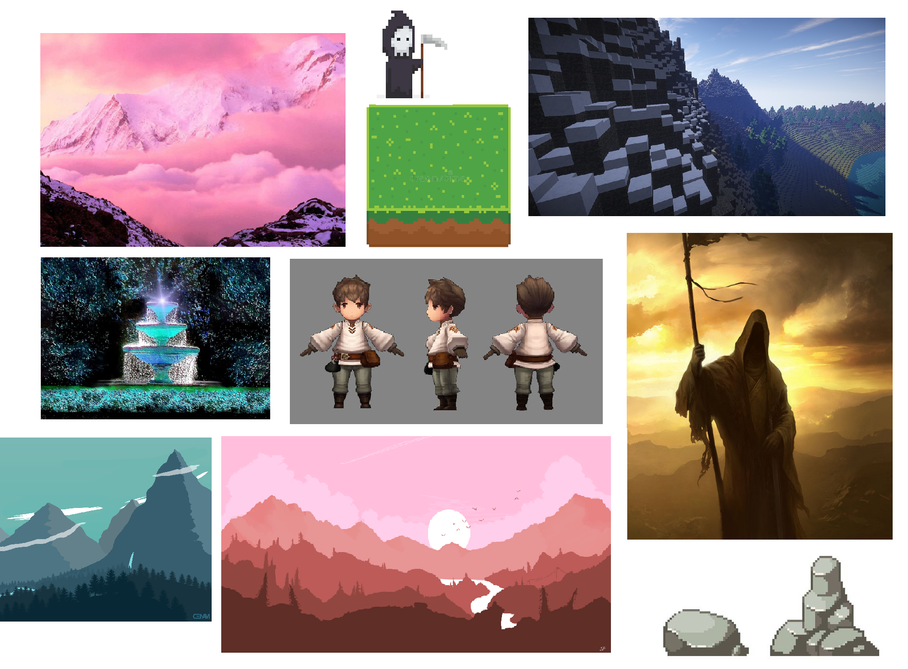

Environment: 

Main Character:

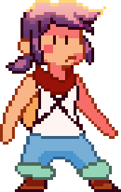

Items/Assets/Enemies:
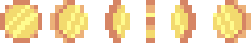

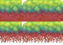
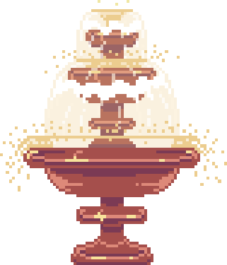

Idle, run, and jump animations:

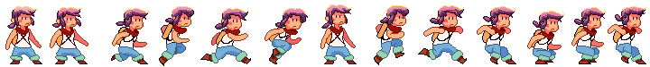

Part 1:

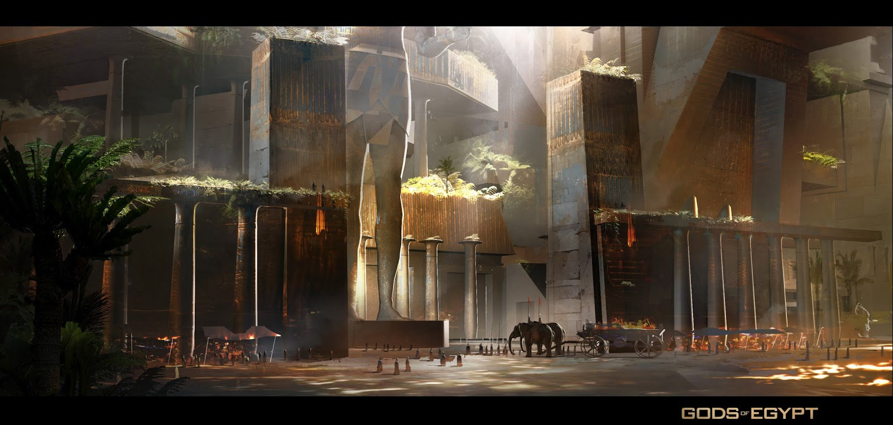
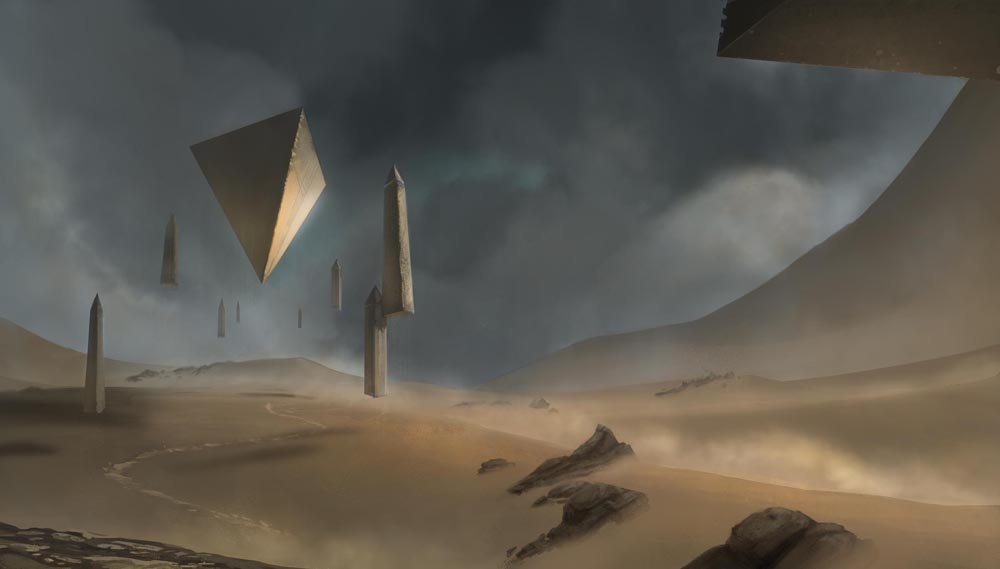
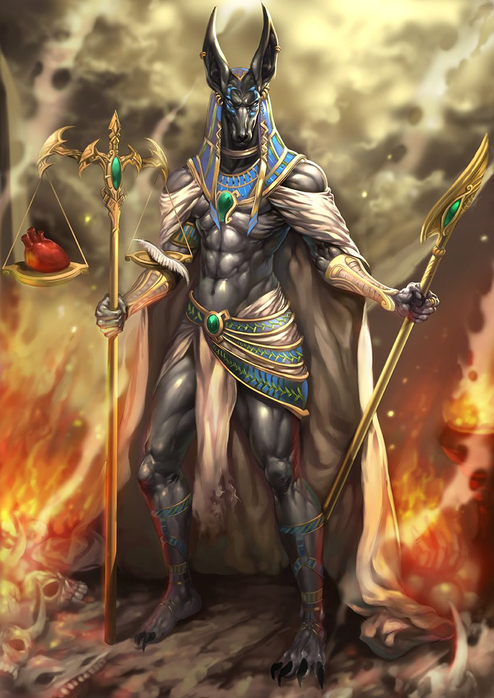
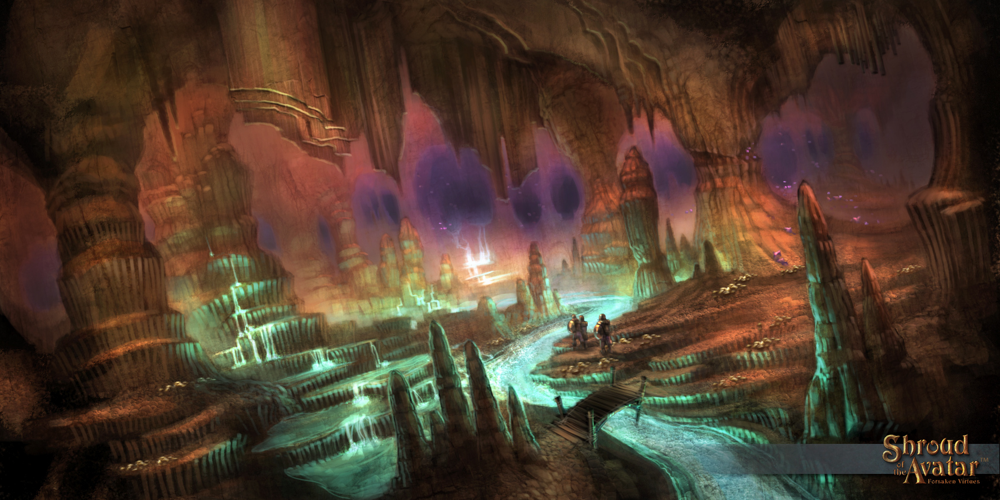
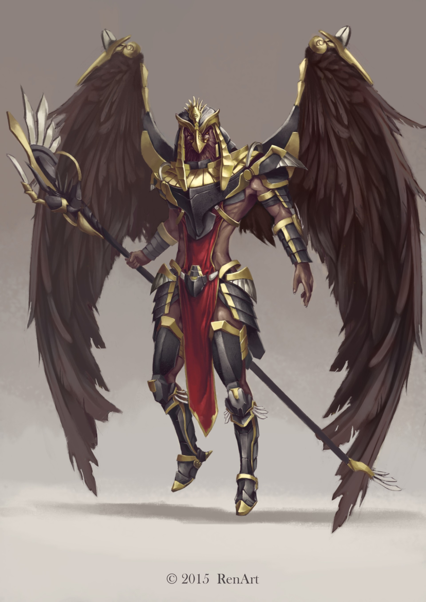
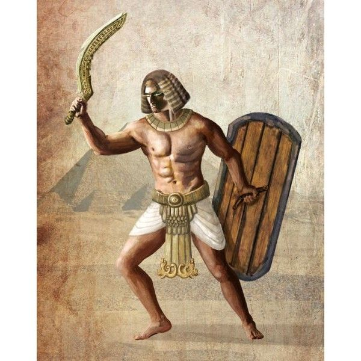
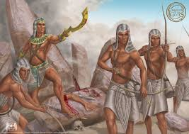

Characters: 

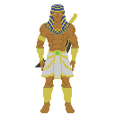

Enemies: 

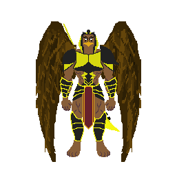
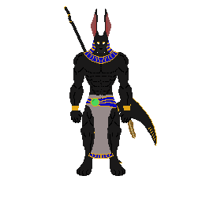
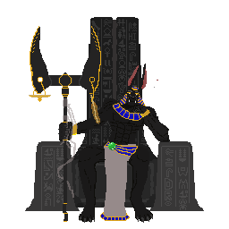

Items:

Environment: 

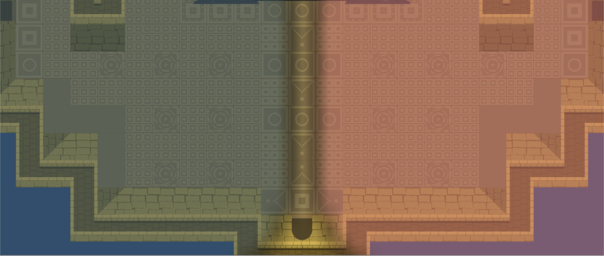

Part 3: 

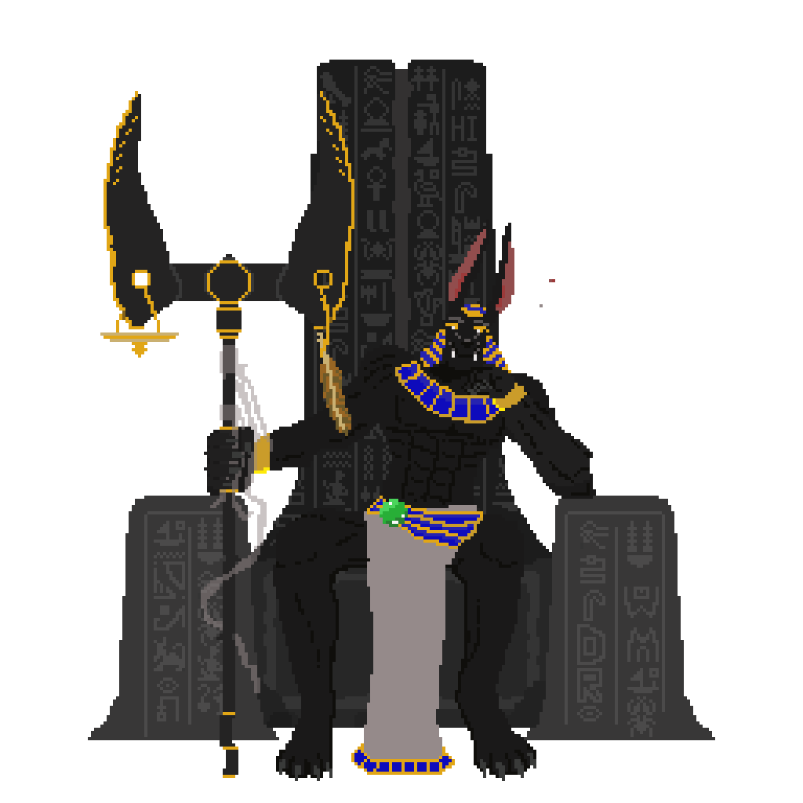

### Resources:

[Piskel App] -  A place to create animated sprites in pixel art
[Code and Web]- A sprite sheet maker
[Unity 3D tutorials]  -  A myriad of unity tutorials on a variety of topics
[Itch.io game assets]- Lots of free game assets you can use as references
[Map Editor] - Tiled - A program which lets you design levels, maps, etc by importing your own art
[Tiled2Unity] - Tiled2Unity - Used to import Tiled files to Unity assets
[Studio Mini Boss Blog] - Awesome pixel art tutorial master page, everything from character design to pretty rocks to animated loops.

[Part 1 Submission]: http://tinyurl.com/s24proj1p1
[Part 2 Submission]: http://tinyurl.com/s24proj1p2

[Piskel App]: https://www.piskelapp.com/ 
[Code and Web]: https://www.codeandweb.com/texturepacker
[Unity 3D Tutorials]: https://unity3d.com/learn/tutorials
[Itch.io game assets]: https://itch.io/game-assets/free
[Map Editor] http://www.mapeditor.org
[Tiled2Unity]: http://www.seanba.com/tiled2unity
[Studio Mini Boss Blog]: http://blog.studiominiboss.com/pixelart